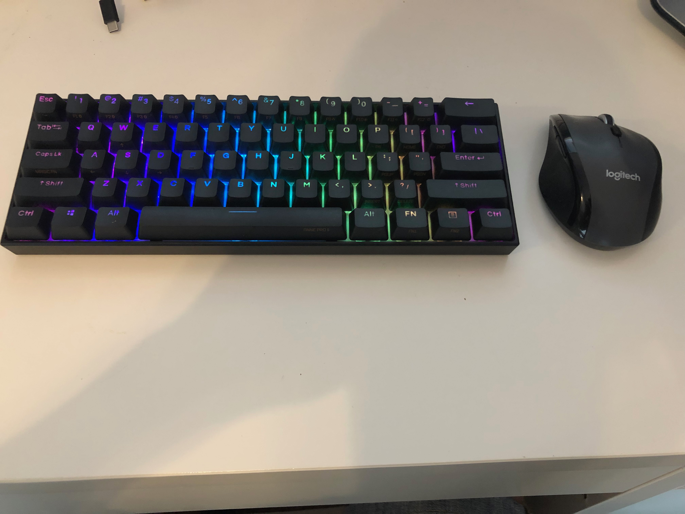
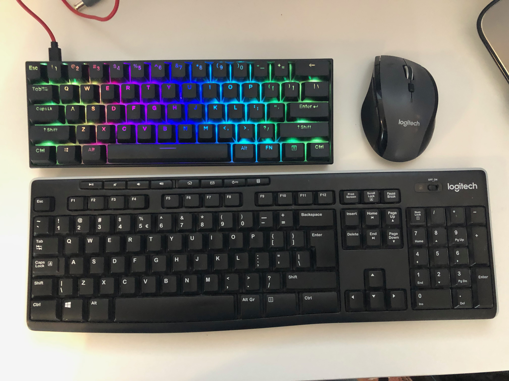
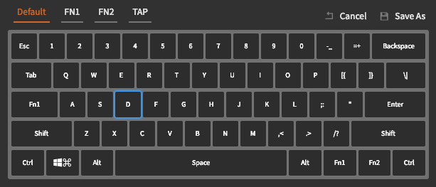
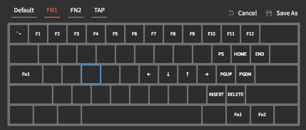
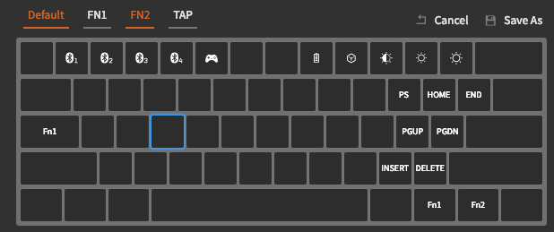
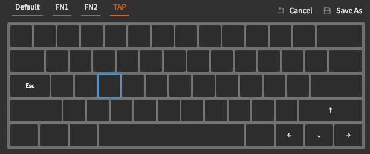

# 4 - EN — Public love to private Anne — how my journey with mechanical keyboards begins

In this blog post, I would like to describe my impressions about working on mechanical keyboards, especially on my first own one — **Anne Pro 2**.
I will begin this blog post with describing reason what push me to try mechanical keyboards and why I choose that particular one. Then I will go deeper with describing our guest of today blog, which is **Anne Pro 2**.

## Every journey has own beginning
I was never _a demanding_ developer. What was important for me is to create new functionality and software.  I do not put much attention for **tools** on which I was working on. At that point of time it can sum me up with one sentence _it’s no matter on which you code, the important thing is to code_. I do not need a new laptop each year or two, just replaced them when they were obsolete. Furthermore, I do not put any attention to devices which allows me for direct _communication_ with my laptop — mouse and keyboard.  At my office work I was using [Dell KB2016-B](https://www.x-kom.pl/p/338132-klawiatura-przewodowa-dell-kb216-b-quietkey-usb-czarna.html), which was provided by my employer, for more than 4 years.  As mouse I use Logitech, which I rescue from throwing to rubbish at the previous workplace — This mouse was my daily driver for 8 years and I still keep it out of sentiment. 
At my home, where I do some after work projects for fun, I had [Logitech K120](https://www.x-kom.pl/p/595519-zestaw-klawiatura-i-mysz-logitech-mk295-silent-wireless-grafitowy.html?gclid=Cj0KCQjwjo2JBhCRARIsAFG667WU4DZJvWrZwy5ZwYmpToKki_YSU61P93YgSsLhsXl5EhbARh3vBzkaArH8EALw_wcB) wireless — I have a small desk, so I need to remove any wires from there. 

### Bad beginnings of good
As you can calculate it simply by working 8 hours on my office and then at the evening for fun, it sums up to 10 – 11 hours per day spend mostly on writing. My body starts to complain… My fingers and wrists start to hurts. Finally, writing more than two lines of text was for me a challenge.  This pain steals from me joy from programming at all. First though which came to my mind, after systematic finger stretching, was that my keyboard was just used up. At the next step we make within team big test of keyboards — we all have the same model as it is standard equipment. We start testing, and it turns out that my keyboard is _the hardest_ and when you write on it, you have the feeling like writing off a plain wooden table.  It’s agreed with its age, it was oldest as I was the employer with longest work period.

So, I made a request for a new one, which I get on my desk a couple of days later. What’s surprise, pain was gone… For 3 months period… After this 3 months we make team keyboards test once again, and it turns out that again my device was most used from all. It’s become obvious that it’s not matter of the device itself, it’s matter of me. I was sure I do not want to change keyboard each 3 months period.

### Mechanical switches - New hope
I dig deeper into keyboard topic and what was surprising for me, it turned out that exists something like **Mechanical Keyboard**. In that keyboard, each switch is mechanical, and it can stand couple times longer than one used by me till that time - membrane keyboards where under each key silicone membrane is present, like in remote controls.
First thought: So if it stands a couple of times longer, I’m going to change keyboard less frequent. I started to explore topic of **mechanical keyboards** and I figured out that in the past there were only mechanical ones… Unfortunately, production cost-cutting lead us to membrane keyboards - they are much cheaper in production. 

Fun fact! In case of keyboard, we have similar situation like with watches. In past days world knows only mechanical watches, next after introducing quartz watches, which production was much cheaper and simpler, quartz watches pushed out form market mechanical ones. This has the same place when it comes to keyboards. What’s worth mentioning, in last year's mechanical watches had second youth. They are called watches which contains soul inside, furthermore prices of mechanical watches flays to the sun. People start investing money in mechanical watches - business model works like this: you bought watch, wait a couple of years and sell it with much higher price. 

### Hardware requirements
Decision has been made! **I am buying a mechanical keyboard**, these are requirements which my first one should fulfill:
- Brown mechanical switches
	I choose brown switches as they are between red and blue ones. At the time of buying the keyboard, I hadn’t great knowledge about types of mechanical switches like I have today. I was aware of 3 types: red (**linear switches**) liked by gamers as they do not make click sound after being pressed. Blue one (**clicky switches**) on the opposite site is loved by writers because they give high clicky sound after being pressed. Lastly, brown ones (**tactile switches**) are in the middle of the previous ones. They give tactile feedback after being pressed and some sound, but much lover then blue switches.
- Bluetooth
	I dislike wires, keyboard should have possibility to connect with device using bluetooth.
- Backlight
	I worked at home mostly at evenings, sometimes in room with dimmed light, backlighted keys will help me with typing - I thought.
	Unfortunately, I need to admit even if backlight at dimmed room looks awesome, I do not use it at all… It turned out that it’s much easier to not look onto the keyboard during writing, touch typing is a real solution. Furthermore, I solve the issue with lack of light by buying proper [desktop lamp](https://ergodesk.com.pl/produkt/lampka-biurkowa-led-10w-na-biurko-z-klipsem/?utm_source=SalesIntelligence&utm_medium=cpc&utm_campaign=SI_138897&utm_content=3090&gclid=Cj0KCQjwjo2JBhCRARIsAFG667XiHgN0DKs_gXnBhZGtchVxG35Gjr0OlkyDRSRQobCn_R3AJ1ZjyD8aAiv1EALw_wcB), which have long arm and I placed it above my main screen, so it acts like light bar. All keyboards, which I buy, made do not have backlight, simply I do not need it, agreed it looks spectacular, but I do not need it.
- 60% size.
	At the time when I was choosing new mechanical keyboard was time when I had fascination with vim - as a second way of slowing my problem with hurting fingers and fascination with ergonomic of work. One of the fundamental vim principals is to get rid of arrows keys to allow your fingers to be placed on home row by most time. _Regarding Vim itself I am planning separate blog posts, so for now, let do not dive in this area_ 
	60% keyboard layout we can imagine as left part of keyboard when you slice it on arrows cluster. Details could be found on [link](https://deskthority.net/wiki/60%25).
- Price
	This is not a mystery, price plays one of the main roles. Mechanical keyboards aren’t cheap, furthermore I do not have any experience with any. I was afraid of investing in expensive product and be disappointed when it will not solve my problems. 
### Keyboards candidates
According to my requirements, I found two main candidates to buying:
- [Ducky One 2 Mini RGB](https://www.duckychannel.com.tw/en/Ducky-One2-Mini-RGB)
- [Anne Pro 2](https://www.hexcore.xyz/annepro2)

These two keyboards have similar functionalities, but **Anne Pro 2** is cheaper, what’s important. Furthermore, Ducky One do not have bluetooth capability. 

### Decision has been made
Finally! Decision has been made. After checking market and prices at shops, I decided to buy one from China store. This option is much cheaper than ordering from European sellers. It wasn’t available on Polish market at a time of buying. I choose optimal solution for me and order my _Anne Pro 2_ from [Bangood](https://www.banggood.com/custlink/KGGR0VkT32).

### Christmas at end of summer holidays
One and half month from order date my _gift_ arrived. When I get it to my hand, I immediately go to plug it in.
This is how it’s presents 5 minutes after unboxing. Please forgive me quality and lack of artisan layout - I never thought that I will be writing a blog post about it. At that time, I wasn’t thinking about the blog at all. 

On this picture with comparison with my former_Logitech K120_

My primary impression after getting out this keyboard from box was weight, 600 grams, comparing to standard membrane keyboard is like earth and heaven. It reminds me movie flying over internet when one guy smash keyboard on head of fried. I would not like to watch similar video with **Anne Pro 2** it would be tragic. 
The keyboard can be plugged into the computer using the USB - C port, so I do it. I prefer not to waste time for setting up bluetooth at first run. I sit on my chair, put my hands on a keyboard and had immediate feeling - keyboard profile is different that what I am used to. Likewise, I was writing on flat chiclet keyboards. I hope it would not turn into disadvantage… Soo.

**It has begun** 

With each key being pressed, my smile was growing up a little till it boundaries after the first sentence. My fingers were moving over the keyboard - rather proper word for it would be fly above it giving me real pleasure. I was afraid of one thing - stoping of writing… While took me to understand what was real cause of my emotions regarding this keyboard. First it’s just feeling of keyboard and second which is the same important as first one is sound. Membrane keyboard ale rather silent, or they have plastic sound. **Anne Pro 2** sound gorgeous, I get feeling like this is sound of gun fire with some silencer but, weak one. To sum this up. I’ve tried one, and now I know that I do not want to go back to my previous one, _Logitech K12_. I could spend a lot of time describing pros in one in each paragraph but… I am not a professional writer, I am a developer. To keep it short. First time of my life I feel joy of typing itself. It’s a similar joy, like compiling my first code at primary school. **I RECOMMEND** each of you to give it a try. In my case, this joy is with me each time I am writing on a mechanical keyboard. Furthermore, this joy push me to turn into new hobby. I started after some time builds my own DIY mechanical keyboards, but this is a separate story.

Please check below typing test movie which I recored after unboxing **Anne Pro 2**
  
[ Anne Pro 2 - typing test after unboxing](https://youtu.be/2EF1mnwJGzc)

To sum up… I spend working on **Anne Pro 2** about 2000 hours and I do not regret any minute with it. (How I estimate time - keyboard count’s it). Keyboard still sound that good how it was on beginning. What changes are colors of keycaps which was attached to keyboard itself. Apart from cleaning this keyboard regularly, high profiles keycaps are catching dust very intense. I do not put it into a locker, it’s my daily driver, so it’s always lay on my desk ready for a new journey, like writing this blog post. In my opinion, it would not be proper to write it on other keyboard, then our today hero.

Move below was recorded during writing this blog post, after 2000h spend with **Anne Pro 2**. For me, each time feels like a first time.
 
[Anne Pro 2 - typing test after 2000h](https://youtu.be/o_JjdYjP-pQ)

### Anne Pro 2 - pros
I would like to present some advantage of **Anne Pro 2**, as it turns out some of my former requirements isn’t relevant anymore. 

Pros which confirmed:
- Awesome feeling brown switches when writing
- Bluetooth connectivity 
- Compact design
- Durability 

**Anne Pro 2** surprised me with some features which I do not expect. Now, these features are key features for all my new keyboards. So let’s talk about them. 

#### Fully programable keyboard
**Anne** is a fully programable mechanical keyboard. Which means, each key can be assigned to any _action_. Simply - Would you like to turn *Capslock* into *Esc*, not problem at all. Would you have special character row instead of number row - fairly easy to achieve, 4 minutes with attached software, and it’s done. The one boundary is your imagination, you can personalize your keyboard that it will suit you and be adjusted directly into your workflow. 

#### Double purpose keys
This functionality changed my way of thinking about all keyboards... Standard layout consist of 104 keys. Our hands to reach all of them needs to move almost on half of desk to make proper keypress. Why then do not decrease number of keys? The same reason is behind me choosing 60% keyboard. **Anne Pro 2** supports _**Tap mode**_, which means that each key can have dual function. First function is triggered when key is pressed and released, like all standard letter keys, - this is so-called _Tap_. Second function is that key is pressed and during that time you press other keys. A great example is *Shift* key. When you press **a** it types just a small letter, but when you hold *Shift* and press **a** key, on screen capital letter **A** will be printed. Same with other so-called function keys like *Cmd*, *Control*. 
Dual function keys is like combining standard keys activated by single key press with function keys which change the meaning of a key when it’s pressed.

On my **Anne Pro 2** I have redefined, mentioned earlier, *Capslock* on *Esc* with single click. So, when I press *Capslock* then *Esc* will be called. On the other hand, when I press this key and during this time I will press *J*, the keyboard will send a signal responsible for down arrow. 
As **Anne** does not have arrow keys, so I set it up accordingly to *Vim* mappings. *H-J-K-L* during *Capslock* being pressed are respectively *Left-Down-Up-Right*.

Sounds complicated? I thought so on the beginning, but when you think about it deeper, it seems to make perfect sense. How many times in your _IDE_ during intelisense or other dropdown list with function to use, your hand is moved from home row to arrow keys. Often right? In my keyboard it’s needed to press *Capslock*, which is next to *a* letter so can be easily accessed with small finger, then without moving hands from home row. My index finger which usually stays on *J* letter do not need to move at all because this key is now down arrow. Instead, moving whole hand to arrows cluster, a small move from *A* to *Capslock* is needed. For me… **Killer feature!**

#### Layers
Layer is assigning new meaning to a key when other is pressed, so-called function key. It’s connected to previous paragraph. Great example is mentioned before *Shift* key which change layer of small letters into layer with capital ones. **Anne** makes exactly the same with F keys *F1* - *F12*, which physically do not exist on it. All is needed to press proper modifier key - in my case famous *Esc* which change each of the numeric keys became proper F key.

#### Software
I recommend application [ObinsKit](https://www.annepro.net/page/custom/software-downloads), which is responsible for configuration of **Anne**. Nice feature, is time tracking, this counts number of hours during using keyboard. Furthermore, it allows for all customization which I was writing previously.

### Anne Pro 2 - drawbacks
There is no ideal product, **Anne Pro 2** neither, but I wish each product to have that kind of drawback like this keyboard has.

- Hours counter resets after big software update.
	**Anne** is equipped with time tracking, this great allows you to have overview how much time you spend in front of pc or just working with this keyboard. Fun fact, in my case with when number of hours increases, my regrets for spending so much money just gone. Unfortunately, the software update reset this counter. Current status is about 630h, but truth is, I count it before upgrade, when I sum it up it hit 2000h.
	I need to admit that I was informed before update about reseting the counter. Thanks, this warning, I was able to write down my old value.
- Problems with Bluetooth connectivity
	As with my 2020 MacBook Pro **Anne Pro 2** establish connection each time, as with my company Dell, powered by Windows 10, it has some struggle. I was always able to make connection finally, not always I want to fight with it for 5 minutes. **Anne** can be paired with 4 devices, in my case these devices are: MacBook, iPhone, iPad, Dell. Frankly it works flawlessly only with MacBook Pro, at second place, I would place, iPad. To confirm once again, I had no situation that I was unable to connect it over Bluetooth finally, sometimes it takes just little more time the usually. On the other hand, a couple of times I was able to easily switch between devices by pressing keys on the keyboard - It really works. Nevertheless, I do not have big enough desk for two notebooks, so I used this rather by occasion than on daily basis.

## My setup
### Default layer
As I mentioned in pros of **Anne Pro 2** is fully programable, so I would like to share my setup which is works for me.
First layer is so-called default layer - this layer is as name says default. These keys are available without any modification.
Below image with my layer, as you can see there are basic keys. 

Main modification, which I made, are changing *Capslock* into *Fn1*. These changes layer to *Fn1* when you keep pressing this key. Bottom-right side is repeated *Fn1* key and next to it *Fn2* which allows for switching layer into *Fn2*.

### Fn1 layer
Layer, which can be accessed by pressing and hold key with sign *Fn1*. In my case, this is *Capslock* and second key on the right from the spacebar. *Fn1* layer, which is shown on picture below, give me access to arrow keys accordingly to _Vim_ mappings and function cluster which on standard keyboards is placed above arrows. 
 
Apart from this, **Anne Pro 2** on this layer change num row into *F* - row. To give an example, when you would like to press *F5* all you need to do is to press *Capslock* and *5*. Sounds like much? In fact, in real it’s much quicker then manually click *F5* button and back again to home row.

### Fn2 layer

Technical layer, where are defined bluetooth devices, battery status and backlight.

### Tap layer

Tap layer - layer of short clicks. In my case, *Capslock* after short click is equal to *Esc*, when I keep it down it will change layer into *Fn1*. On right bottom corner I placed arrow keys, which are mostly using to scroll videos when. In that case, only one hand is needed.

## Wrap up
It’s worth it? In my opinion, **YES!**
My simple advice is to give it a try. I hope you have friend who own mechanical keyboard, ask him if you can simply test it. My **Anne Pro 2** already convinced two people, who want to check if *mech* keyboards are for them. One person finally bought a twin sister of my own. He was so excited with my **Anne Pro 2**, that he want the same one, from the same shop. Second person, finally do not bought *Anne*, but keyboard from Logitech. Nevertheless, was convinced to mechanical keyboard's ass well. Each time I meet this person, he is very positive about his choose and grateful that can use my **Anne** for some time to make his mind.
 
Do I recommend **Anne Pro 2** ? **Totally YES!**
Numerous advantages put this few cons into a shadow. So, when you think about it, you always think about pros and need to think little to find drawback. Would I buy it again? Yes! For whom I recommend it? Everyone, this keyboard is really versatile and number of features would pleased everyone. On the web this keyboard is advertise ad gaming keyboard which, in my opinion it’s not fair - I mean assigning it just to gaming category. This keyboard is just a heavy pice of good, professional stuff. This keyboard will pay back to everyone who spends big amount of time writing on keyboard.

Best!
amidevtech