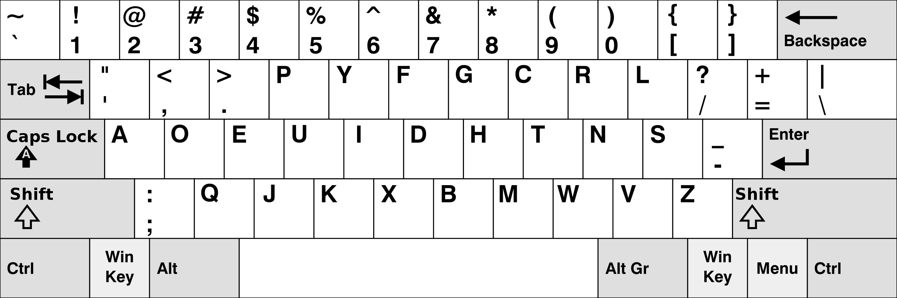
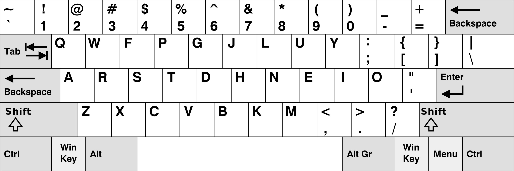
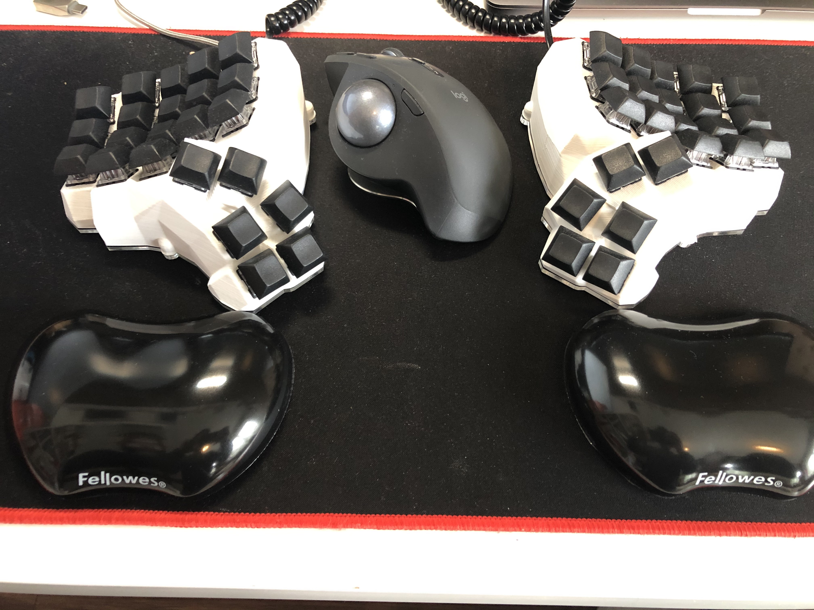
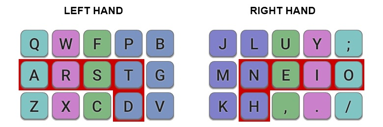

# 5 — Why your standard keyboard might not be right for you.
Anybody of you have ever thought about reasons behind keyboard design? I mean, why keyboard looks like in that particular way, why each row is shifted into right. The second question is why letters are placed in that order, not a different one. What makes that designers made that particular design choices, not different one. This brings us to today blog post topic.

## Some introduction
As you may suspect, _typewrites_ are ancestors of our modern _keyboards_. Naturally, our _keyboards_ are adjusted for new functionalities but when we compare plain layouts of modern _keyboard_ with that one from _typewriter_ it looks almost the same. Let’s look on pictures below:

[Keyboard](https://en.wikipedia.org/wiki/Computer_keyboard#/media/File:LenovoKeyboard.jpg)

[Typewriter](https://en.wikipedia.org/wiki/File:Typewriter_%22Adler%22.jpg)

_Modern keyboards_ or _keyboards_ that I will be naming this electrical devices from now days, are evolution of _typewriters_. As we look into the pictures above, keyboard core consist of letters placed in three rows where each row is slightly shifted into right. At the bottom is a long bar which we called, even _spacebar_. Naturally, _the keyboard_ has more keys, as it is an evolution of _typewriter_. It addition it is equipped with function row keys, arrows and in full-sized keyboard numpad. 

## Row staggering
First thing you see on keyboards is that each keyboard does not have columns. Each row is shifted slightly into the right, that’s so-called **row staggering**.  Once I heard that this shift into right is because of the length of _Shift_ key.  Quite nice explanation which is naturally not true. Second explanation which give my friend is that it’s _ergonomic_, but unfortunately, he can’t explain why. He sums it with words, “It’s by some reason, I think it’s ergonomic.” I do not see anything ergo in that shift, furthermore there are tons of research that confirms lack of connection to that. 
So, why? Why keyboards are **row staggered**.  Lets me explain by posting once again picture of typewriter from above. 

[Typewriter](https://en.wikipedia.org/wiki/File:Typewriter_%22Adler%22.jpg)

I choose it in purpose as it show in perfect way this effect. _Typewriters_ were equipped within a mechanism where when you press a key it runs a special, so-called _hammer_ which hits a piece of paper. Core of this device was placed in upper part and each of letter was place one by one, as you can se on next image:

[Typewriter mechanism](https://upload.wikimedia.org/wikipedia/commons/thumb/0/0c/Typewriter.ogv/440px--Typewriter.ogv.jpg)

Parts responsible for printing are placed in a one row and when activated hits paper in the middle. Keys are much wider, and simply it’s not possible to place them accordingly in one row. Keys are split into three rows with different length of leg which connect them with core mechanism. This shift in most popular _typewrites_ is about 1/4 key length, as we have 4 rows. Number row and three rows with letters. Thanks to this approach, _typewriter_ mechanism is much more simpler. It’s looks like on the drawing below.

Naturally is gets more complicated when the second column would be placed, connections between key and printing hammer would be below the second key. Picture above just show idea. It’s not ergonomic approach or any kind of design which should improve our typing — reason is just _typewriter's_ limitation which was propagated to _keyboards_ which in fact do not suffer for that kind of limitation and could be designed without it. 

## QWERTY layout
Second thing is placing keys in that particular order, what’s bring us to **keyboard layout** called _QWERTY_ as it is most popular. First, you need to know why _QWERTY_ was designed in that way. At the beginning, keys on the _typewriter_ keyboard was placed in alphabetical order. Unfortunately, this causes problem, during quick typing when two near one key was pressed once after another _typewriter_ stuck. If you have had the possibility to play with a real _typewriter_, you should be familiar with this problem. I have had that Opportunity as a child and I remember when I pressed at the same time keys in nearby like **A** and **Q** my _typewriter_ stuck. 
_QWERTY_ was especially designed to solve this problem. So, in short, there were made some research and letters on _QWERTY_ are placed as far as they can be. In more scientific world, _typewriters_ stuck when during quick writing two letters (_bigram_) was nearby on keyboard.  In english the most popular bigrams are: **th**, **he**, **in**, **en**, **nt**, **re**, **er**, **an**, **ti**, **es** and much more. In this approach, keys for most popular bigrams shouldn’t be placed next to each other. That’s how _QWERTY_ was designed as layout to minimize nearby of most popular bigrams in English language.

## Why it’s so popular
Surprised? I was, when I got to know that. You can ask question then, “So if, it’s connected only to _typewriters_ why we use it nowadays”? Answer is I much simpler than you probably could expect. Keyboard keep that shape because people were used to them. On the beginning of computers, much more important was the ability to quickly switch from _typewriters_ to _keyboards_. The typist was familiar with that layout, so it stays as it was. There were groups of people who can effectively use these devices, so let’s use them. There is no big theory behind of it, designers decided to leave _keyboards_, as they were already known. That approach is maintained until present days.  Manufactures put more attention to thing which are already well-known, then try to experiment.

## QWERTY drawback’s 
I guess nobody expected that such of popularization of computers, nowadays, computers are on our daily basis. 
Furthermore, there is much more computer related jobs, where you spend about 8 hours par day in front of computer. We as society develop work which was not existing before IT era. I am a developer, I am whole day look into screen and write code which will not exist outside computer. We type a lot as, this is the way of _talking_ to computer.

I wouldn’t say _QWERTY_ is bad, I would rather say it has two main weak points, which for people who sped big amounts of time in front of screen could it cause some inconvenience? I already wrote of this two thing above — these drawbacks are design limitation of past years. 

### Row staggering
I explained already origin of it, but what’s are real consequences of it. Consequence is that you need to stretch your fingers during typing in more in naturally way. Long typing sessions could cause some wrist and fingers problems. I passed I faced this problem, my fingers simply hurts when I was typing for longer period. 

### Layout
As _QWERTY_ was designed to put big distance between letters in common used bigrams, overall *finger travel* (distance between followed keys, measured in keys space) is not optimal at all. Most common letters in English language, **E** and **T** are not convenient places. One thing is sure, it can be done in more optimal way.  

For me, as a person who type a lot with all 10 fingers, best would be to have most used letters on **home row** (middle row of keyboard where fingers should be placed, each finger on next followed key).

## Modern layouts alternatives
There are couple **modern** alternatives for _QWERTY_ layout. Two most popular are _Dvorak_ and _Colemack_. 

#### Dvorak 

_Dvorak_ layouts relay on hand alternate. On one hand, of home row, there are all vowels and most popular consonants on other ones. 

#### Colemak

Second most popular alternative keyboard layout is _Colemak_ which as a main approach most used letters on home row with ability easy type bigrams. It’s feels to be like a **swing** from one side of keyboard to second one. 

## My keyboard
As keyboard enthusiast I have possibility to type on couple, _weird_ DIY mechanical keyboards. Nevertheless, I would like to share my current setup with you. 
To remove _row staggering_, I use ortholinear split keyboard. Thanks to that, my fingers are move simply up and down on the keyboard without shifting them on a side. My setup hand wired _Dactyl Manuform_ with _Logitech MX Ergo_.

For keyboard layout, I use _Colemak Mod-DH_ for matrix keyboards. It fixes some original _Colemak_ drawbacks.
This layout looks the following:

Red border shows the easiest keys to use, in addition, most used letters are placed on this easy to access keys. 

## Summary
Taking all mentioned above into consideration, shall you change to ergo keyboard with different layout? Answer is… It depends. If you are casual user who spend in front of computer not big amount of time. You should not change anything in my opinion. Learning period will consume some time and energy, and probably it’s not worth it… Of course, If you like to, please, this can be very funny. In fact, for me, learning a new layout on a new keyboard brings a lot of joy.
O the other hand, if your daily work is tightly connected with computers and for greater part of the day you are typing, I would suggest thinking about benefits from change. Invested time will pay off. Will you write faster? Probably not, but definitely your fingers will be grateful for change. 
The case is like with ergonomic chairs, if you spend reasonable small-time in sitting, you can do it on any chair you want without hurting your back.  Nevertheless, if you spend most of the day siting in this chair I would suggest buying an ergonomic one, your back will thank you for it.  Taking accounts keyboards, if your daily work consist of typing, consider the change… Your hands and fingers sooner or latter will thank you.

_____
That’s all for today!
Thanks for reading.
Best! 
amidev

