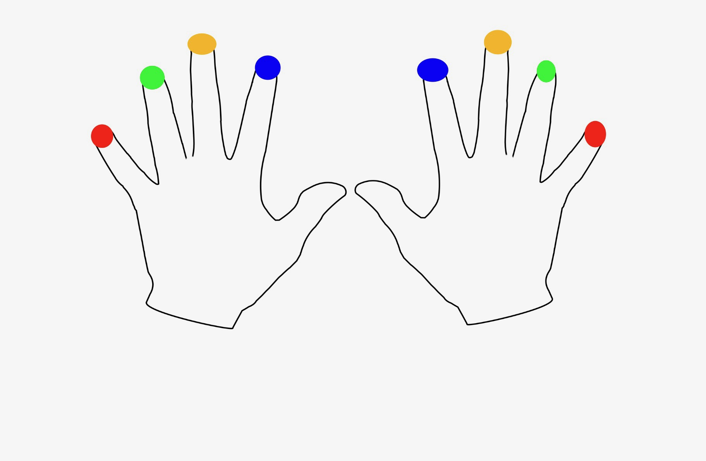

# Ortholinear keyboards 
This blog post is the first from a series where I would like to focus on ergonomic mechanical keyboards. In this particular one, I would focus on **ortholinear keyboards**. Together, we will take closer look how this keyboard is built, based on most popular brand, furthermore we put this layout into comparison with standard layout.

## What are ortholinear keyboards
As you may know, a standard qwerty keyboard is _row staggered_, which means that each next row is shifted slightly into the right. This solution is a drawback of past times, and it’s not needed any more in modern keyboards. My previous article [Why your standard Qwerty keyboard might not be right for you](https://www.amidev.tech/why-your-standard-qwerty-keyboard-might-not-be-right-for-you/) describe in details this design choice and is its pointlessnesses in modern keyboards. 

If _row staggered_ rows are not required for keyboard to be working, it’s matter of time when new design without it will be made. Naturally, as _row staggered_ _QWERTY_ layout is so popular, ortholinear keyboards are no in main stream. In my opinion, that type of keyboards is a first step, which can be made to **ergonomic keyboard**, by removing one from two of _QWERTY_ characteristic.  

Below there is standard 60% keyboard layout — 60% which means keyboard without, function keys, number pad and arrows. That kind of layout you can be meet in, described earlier at this blog, [Anne Pro 2](https://www.amidev.tech/public-love-to-private-anne-how-my-journey-with-mechanical-keyboards-begins/).

Now, let’s imagine you would like to remove row staggering. The only thing you need to do is to _squeeze_ the first column of keys on the left to 1U size — (1U it’s the size of one standard key — like letter key). In this example size of following keys: _Tab_, _Caps lock_, _Shift_ shall have same length like key in top-left corner. Second step is to adjust keys position to this column on left, thereafter, we should have some kind of matrix layout like on followed picture:

I hope, you were able to imagine a layout similar to the above picture. Naturally, the last right column needs to be reorganized, as it consists of 12 columns. That particular layout is just one from many, but truly it could be whatever you want. You need to admit, at first, this look odd. Probably reason is that for whole your life you only saw _row staggered_ keyboards. Maybe even you think, typing on this will be uncomfortable. It’s okay, most of the people are afraid of change and would stay with things which they are used to. That’s **the real reason**, why _QWERTY_ is so popular. On the other hand, on this blog we are thinking about improving our work quality, which is directly connected with typing. I guess we need to agree, not everything what’s popular is most profitable for us.

## Ortholinear keyboard in action

Question is, how it feels typing on it? Let’s try to think about from theory perspective. Nevertheless, I hope you would be able to type on ortholinear keyboard, it’s quite interesting experience.

So let's try how our fingers fits to ortholinear layout.

Picture above show draw of hands with nails paint in different colors. Color are placed in symmetry of fingers. Next, with the same color we mark keys for which that fingers are responsible — we are considering only keys with letters. In _QWERTY_ layout it looks following:

First what comes to my mind is, what’s obvious, columns are not vertical. I would like to ask to make small exercise. Please put your hands on keyboard in proper way, on **home row**: Fingers of left hand starting from the smallest one should be placed on keys **A**, **S**, **D**, **F**. Fingers of right hand starting from pointing finger should be placed on: **J**, **K**, **L**, **;**.

Next, try with each finger to reach to keys painted with the same color. I can bet, if you weren’t training touch typing with 10 fingers, a couple of times you miss the key. Personally, I have a problem with **Z**, **X**, **,**, with rest of fingers, also I do not feel comfortable.

How would it be considering ortholinear keyboard?

At first glance, assignment of fingers to keys feels more natural, than in standard layout. Please consider this, fingers are forced to move only up and down, what’s seems to be much more comfortable. This is the main advantage of matrix layout, change of fingers moves to more natural. 

# Conclusion 
It’s worth it? In my opinion yes, even only to check if it’s more comfortable for you. In my case, I prefer ortholinear keyboards, what’s more I think it’s worth spend time to learn to type on it. Switch to matrix keyboard do not take much time. I treat it as a nice new addition to day job. I want to play with a new, nice piece of tech. After a couple of days, I felt so comfortable, that I put my _row staggered _keyboard on the shelf.

I would to put stress on one thing. Switching to ortholinear keyboard do not resolve problems with hurting fingers, furthermore it’s not even definition of ergonomic. Ergonomic keyboard consist of two factors. The first of two is physical structure of the device itself, the second is keyboard layout.
Ortholinear keyboard is the first step in one of these two factors. 

---- 
Take care.
amidev

 

