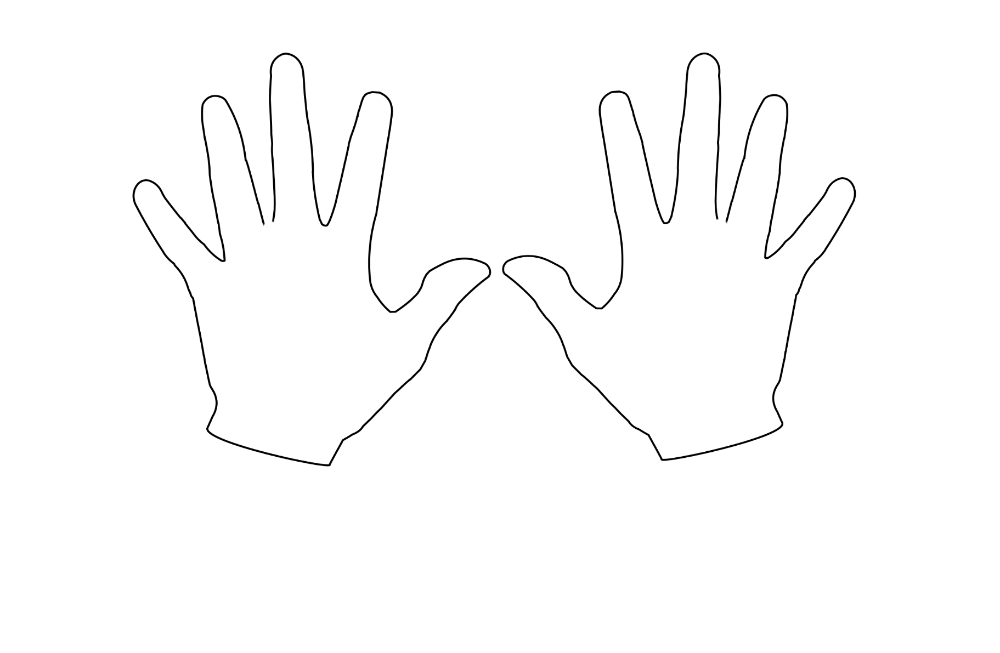
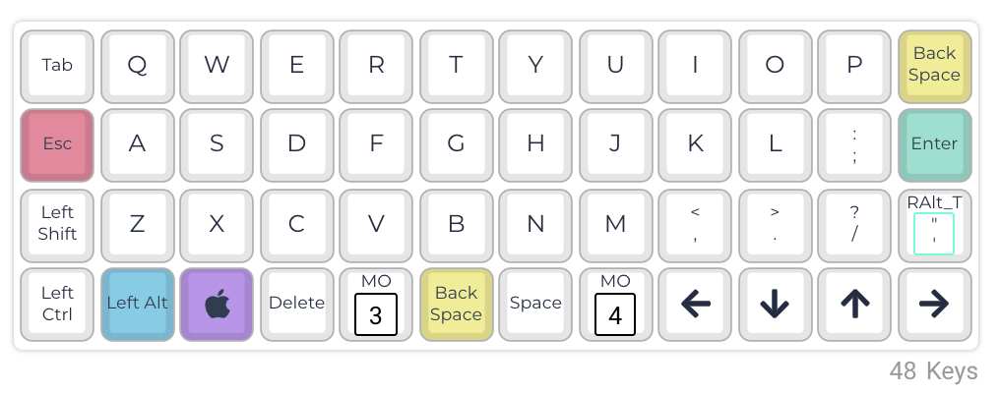
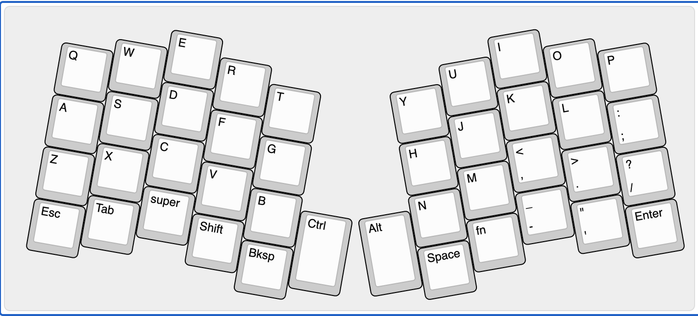
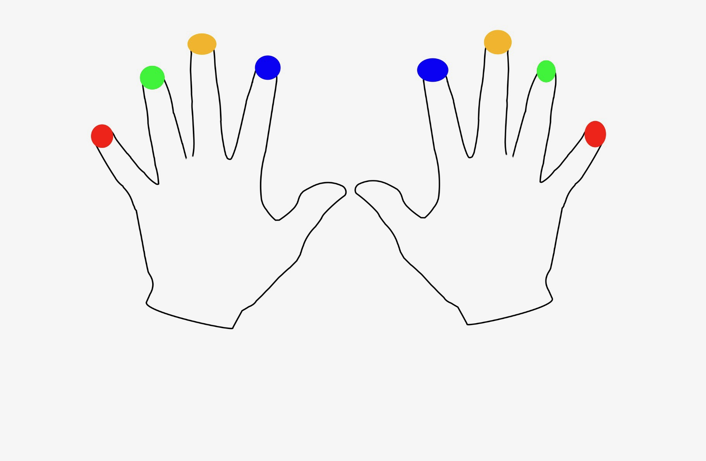
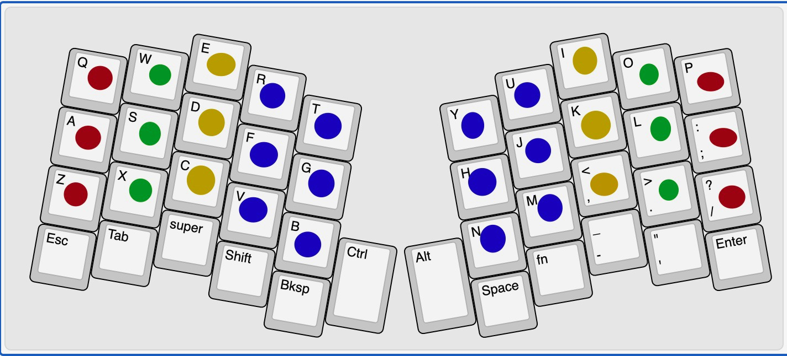
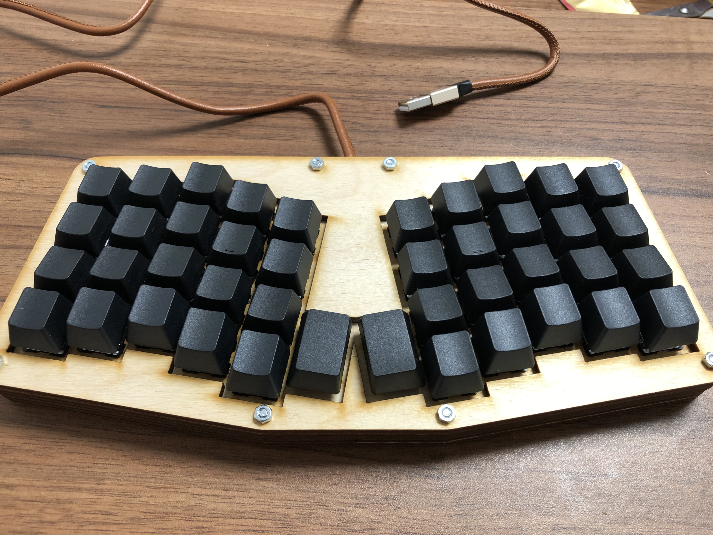
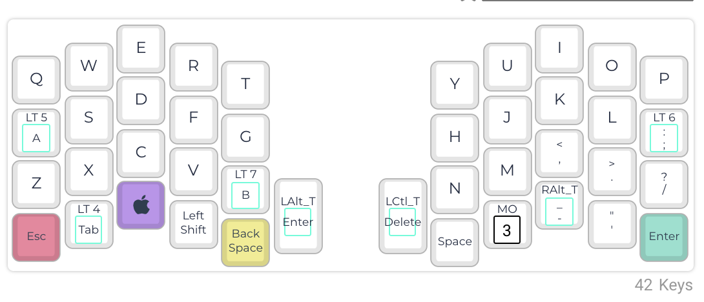

# Column staggered keyboards

Previous blog post about _ortholinear keyboards_ with title [Ortholinear keyboards](https://github.com/amidevtech/blog/blob/main/en/posts/6_ortholinear_keyboards/index.md) describes keyboards which are not row staggered. This was the first step into ergonomics, as this layout feels more natural for our hands and fingers. This was the first step into ergonomics, as this layout feels more natural for our hands and fingers. With this particular blog post, I would like to go one step further than ortholinear keyboards and try to think about how we can make our layout even better for our hands with **column staggered keyboard**.
To remaind what is _row staggered_ keyboard, what was it needing for and why it’s not needed in modern keyboards you can read in blog post with title [Why your standard Qwerty keyboard might not be right for you](https://github.com/amidevtech/blog/blob/main/en/posts/5_your_keyboard_might_not_be_right_for_you/index.md)

With this particular blog post, I would like to go one step further than ortholinear keyboards and try to think about how we can make our layout even better for our hands.

## One step further
First, I would like to recall a picture from a previous blog post, which represents our hands:

And _ortholinear keyboard_

Thanks to removing _row staggering_ during typing, fingers moves only on vertical axis, what’s in their nature. What if, we would make one step further and take another characteristic of our hands into consideration? I mean different fingers length. We are used to keyboards where keys are placed in straight rows, nevertheless when think about it, it’s not mandatory. Fingers with different length are placed on **Home Row** with one line. This is for sure not best, when it comes to be natural for our fingers. 

Let’s make a quick test. Relax your hand and tap with all your fingers into the desk. Make it a couple of times, after one attempt do not take hand from desk and see how your fingers are placed. Are they placed in a straight line? Probably not. Middle finger is above others and two smallest one are little below.

Why, then we shouldn’t take this into consideration in our keyboards? It’s impossible? **It’s possible**, what brings us to next section. 

## Column staggering

Picture above shows a keyboard where _row staggering_ is removed. Instead, the columns were shifted which gives us a _column staggered_ keyboard. Each column of this keyboard starts and ends in the other point. Height and size of keycaps are exactly the same as in standard keyboard, but it’s beginning of each column starts in different place. When take consideration that kind of keyboard we could find some analogy to our previous exercise.  

Long story shorty. If you made the same exercise from the previous chapter on ortholinear keyboard instead of desk, after leaving the hand on the keyboard, your fingers wouldn’t be placed directly on keys. The same test on _column staggered_ keyboard will end where each finger will be placed near the centre of keycaps. Not on end of keys. 

I need to admit, keyboard layout presented on previous image contains also **split**, which means splitting keyboard into halves, where each of it contains set of keys. Furthermore, keys are placed on slightly different angle, than on ortholinear keyboards, which is a next step into ergonomics. I wouldn’t describe this deeply now, as it will be the main topic of another blog post.

## Column staggering keyboard in practice
To better understand how _column staggered_ keyboards improves in ergonomic, let’s use our hands with colored fingertips from blog post about [ortholinear keyboards](https://github.com/amidevtech/blog/blob/main/en/posts/6_ortholinear_keyboards/index.md).

That’s how assignment of fingers to keys looks on an _ortholinear keyboard_:

In the same way, let assign keys dedicated for each finger on _column staggered _keyboard:

Let’s compare two photos from above and look at them through the shape of our hands. Saying that _column staggered_ keyboard is definitely more ergonomic seems to be obvious. It’s take into consideration different fingers length, which helps with reaching keys. It’s much easier to reach the upper row with the smallest finger, or lower row with the middle one. 

Main idea behind ergonomic keyboards is to reverse whole process of designing keyboard. Classic way is to design keyboard taking into consideration technology and constraints, next try to adapt and get used to keyboard itself. When taking into consideration mechanical keyboards whole process is reversed. At first place is adaptation to human hand and based this principals make keyboard layout.
	

You need to answer, on your own, which solution suits you better. With which keyboard your hands and fingers would prefer to spend upcoming years.

## Real life example
Theory is one thing, but how that kind of keyboard can real looks like? Frankly, like scratch of keyboard layout mentioned above. So, it could look like this:

This is my own **Atreus**, designed by _Phil Hagelberg_, with [project web page](https://github.com/technomancy/atreus). Having a list of parts, I was able to collect them on my own, the keyboard case was cut by a local wood workshop. **Atreus** is my first DIY keyboard. It will always be some kind special for me as from this keyboard my passion starts up.

Currently, you could buy revision 2 of this keyboard, nevertheless it’s no longer a DIY keyboard. You can buy it built from this [shop](https://shop.keyboard.io/products/keyboardio-atreus).

### My own layout
If somehow you would be interested, I am posting my own **Atreus** keyboard layout. If you like it and are interested in it, I could write a separate blog post about it – describing whole layers, the purpose of them, and why it’s activated in that particular way.

As closing mark, I want to mention that currently I have 24 version of **Atreus** layout. This is the real power of fully programmable keyboards. **You decide what each key is responsible for. You adapt a keyboard to your needs, instead of adapt yourself** Each of us has different needs and preferences, why do not satisfy them?

---

Best,

amidev 
