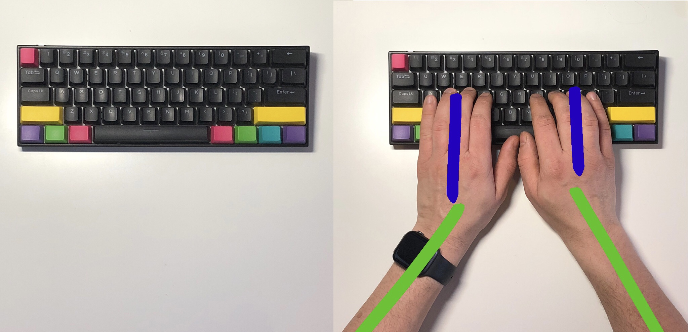
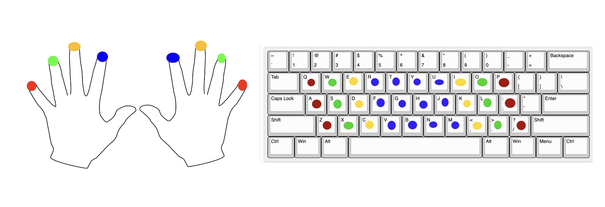
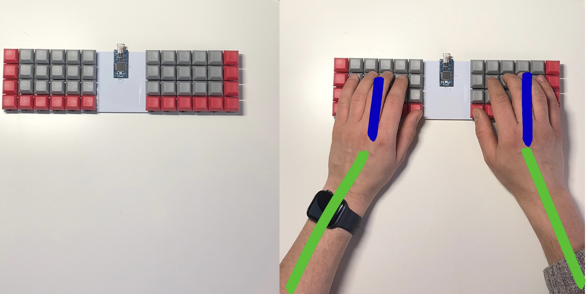
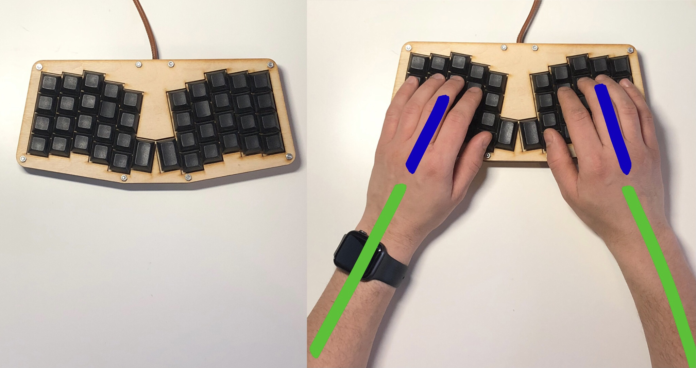
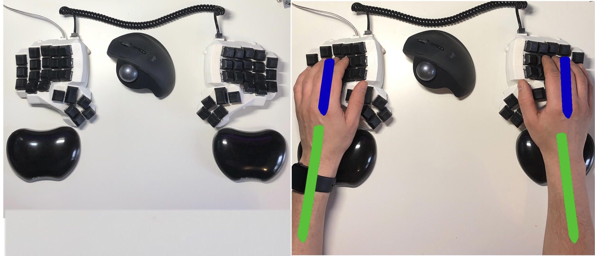

# 8 – Split or not to split – That’s a question.

This blog post is the next one from the series, in which I describe certain features of ergonomic keyboards. Topic of today blog post are **split keyboards**. I would try to answer the question, what are **split keyboards**, what types exist. We go through benefits which comes from using them, on the other hand we check drawbacks of that solution.

At the beginning, I need to put some things in proper order. The previous blog post was about [Column staggered keyboards](../7_column_staggered_keyboards/index.md), to make it crystal clear. _Column staggered keyboards_ usually are also **split** ones, but **split keyboards **do not depend on from the other characteristic. Ton of flavors are of these keyboards. I apologize for not pointing it out in before.

# Split keyboard
How can we easily imagine **split keyboard**? Imagine that you are taking a knife and cut the keyboard into two halves, left and right one, Not cutting switches, but between them. That how from technical perspective **split keyboard** looks from technical perspective.
So, we could take the next sentence as definition:

**Split keyboard** we called that kind of keyboard, where two dedicated halves can be distinguished. Pressing with one hand, the key dedicated to second hand, is not possible to do without taking the offhand from the desk.

## Standard keyboard weakness 
Let’s consider standard _ANSI_, keyboard with **QWERTY** layout, which is the most popular option available on the market, furthermore almost all notebooks are equipped with. Our hands are placed near together. When looked little more carefully to this, two problems can be seen:

- Placing of our hands and wrists is not healthy, and ergonomic.
- Lack of dividing keyboard into two halves with dedicated set of keys for each hand, all of us to use one hand for pressing keys which belongs to another hand. 

### Hands placement

I would like you to take look into above picture. The left half represents a standard keyboard, the picture on the right shows placing fingers on this keyboard. With green lines, I marked my forearms and hands with blue one, for better visualization.

Looking into this picture, you can see that our forearms and hand makes some kind of _funnel_. Forearms are directed inside, hands are stretched to reach properly **Home Row**. That kind of position is not ergonomic at all. It’s not healthy for our shoulders, and wrists which are bent during writing.

### Lack of assignment hand to dedicate half 
Second problem, which do not touch people which write on keyboard with all 10 fingers, is using one hand to type on keys belonging to second half.

To better understand this issue, I will use a picture from previous posts. In purpose, I mark all corresponding fingers with same color. I would like to point out that keys marked with blue color, which mean placed for pointing fingers, are very close one to another. There is great chance that during typing people, which do not type with all 10 fingers, will use once they're pointing fingers alternately to pressing that buttons.

Let’s take me as an example. I have an issue with letters **T** and **B**. Accordingly to division that letters are assigned to the left hand, nevertheless very often I use my right hand to press them. Most frequently when following or preceding letter is placed on the left edge of the keyboard. The second case is when I am pressing _Shift_ key.

## Types of split keyboards
In next paragraphs, I am going to present some kinds of **split keyboards** with corresponding image of finger placement.

### One piece split keyboard 

The first type of **split keyboard** is when we make free space between two halves of the keyboard. On the image I am presenting _an ortholinear keyboard_, but it can be as well standard _row staggered_ one. In that case, we will get some kind of stairs, when looking on inside ending of halves.

- Hands placement
	Taking into comparison placement of forearms and hands, immediately it can be seen that funnel is much wider in second cace. That means, our forearms are placed with not that sharp angle, furthermore angle between forearms and hands is smaller.
- Lack of assignment hand to dedicate half
	This problem does not occur, even small distance between halves of **split keyboard** it’s enough to remove temptation of using one hand to press buttons dedicates to the other one.

### One piece keyboard with angle

Second type of keyboards, are one with divided halves but furthermore these halves are placed with angle.
- Hands placement
	Using not standard angle between halves our forearms and hands are placed in straight line, what is more comfortable and better for our health during long writing sessions. Still, our forearms are placed with some angle to the keyboard. However, it’s much more convenient. Let’s think how to eliminate that, one thing which comes to my mind is to make a larger gap between halves. 

- Lack of assignment hand to dedicate half
	Issue do not exist. 

### True split keyboard

At last one, I would like to present the type of keyboard from above picture. It’s a so-called _true split keyboard_.  This keyboard consists of two elements, which are connected by wire or Bluetooth. These halves are truly independent one from etch other when it comes to placing on desk. 

- Hands placement
	As we can se, on this keyboard hand, and forearms placement is the most comfortable from all presented keyboards. Forearms and hands ate in straight line with the distance of our shoulders. In addition, each person can adjust the gap between two halves to make it as wide as they want. Each person has different posture and need different split gap.

- Lack of assignment hand to dedicate half
	Problem do not exist. 

## Drawbacks of split keyboards
I’ve been using all mentioned, in this blog post, keyboards as my daily driver. After several years with these keyboards, I found only one drawback. This is: **difficulty to write with one hand**.

Let’s take a silly example. When you are watching movie on some streaming platforms – in my cases online courses :) - with hot coffee, it’s difficult to handle split keyboard with one hand.

Now coming to real one. I had some difficulty, especially when using **true split keyboard – last** one from list – during editing audio/video content. During video editing usually, my right hand is placed on my trackball, left one is handling keyboard, as each key is responsible for actions on _timeline_.

Naturally, there are people which are so convenient with this application as they can use only keyboard. In that case, problem do not exist at all. Nevertheless, if you are amateur like I am which uses mouse and keyboard to moving through _timeline_ split keyboard make it little more difficult.  

---

Best,

amidev

 

