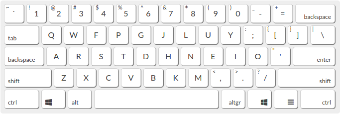

# 10 - Colemak vs QWERTY: Czy warto uczyć się alternatywnego układu klawiatury?
W dzisiejszym wpisie chciałbym zestawić do porównania, dwa popularne układy klawiatur. Mianowicie: **QWERTY** i **Colemak**. Tego pierwszego używają miliony, o ile nie miliardy osób. Z tym drugim, nazywanym *alternatywnym układem* jestem związany osobiście od ponad roku. Co prawda opiszemy, krótko historię oraz ideę, jaka kryje się za poszczególnymi układami, jednak co moim zdaniem bardziej istotne zmierzymy, który układ jest wydajniejszy i pod jakim względem. W końcu postaram się odpowiedzieć na pytanie, czy warto zainwestować czas w *alternatywny układ klawiatury*.

## QWERTY

O samym układzie **QWERTY**, genezie jego powstania pisałem we wpisie [[Dlaczego Twoja standardowa klawiatura Qwerty może nie być odpowiednia dla Ciebie]](https://www.amidev.tech/pl/dlaczego-twoja-standardowa-klawiatura-qwerty-moze-nie-byc-odpowiednia-dla-ciebie/), zachęcam do lektury. Nie mniej jednak chciałbym, krótko przytoczyć najważniejsze dane raz jeszcze. Układ **QWERTY** został zaprojektowany w roku **1873** na potrzeby maszyn do pisania, co kluczowe, zaprojektowany w świetle ograniczeń ówczesnych maszyn do pisania. Ponadto **QWERTY** miało rozwiązać bolączkę tych urządzeń, jaką jest zacinanie się mechanizmu przy niemal jednoczesnym wciśnięciu klawiszy sąsiadujących ze sobą lub niedalekiej odległości od siebie. Rozwiązanie polega na opóźnieniu wciśnięcia kolejnego klawisza poprzez przypisanie go temu samemu palcowi lub oddalenie kolejnej litery na klawiaturze. Należy cały czas mieć z tyłu głowy świadomość, iż **QWERTY** było projektowane dla języka angielskiego. Najpopularniejsze bigramy w tym języku to między innymi: **th**, **he**, **in**, **en**, **nt**, **re**, **er**, **an**, **ti**, **es**, to ich problem miał rozwiązywać układ **QWERTY**. 

### QWERTY a język polski
Wspomniałem w poprzednim paragrafie, iż **QWERTY** zaprojektowane zostało pod kątem języka angielskiego, jakie to ma przełożenie na mój ojczysty język, Polski? Odpowiedź jest, niestety, nie wiadomo… Nasze bigramy, jak i ich częstość występowania nie będzie się pokrywała z angielskimi — to oczywiste. Jak zatem sprawdzić jakość *układu klawiatury* dla języka polskiego? Otóż mam pewien pomysł, jednak o tym w dalszej części artykułu.

## Colemak

**Colemak** to *układ alternatywny* do **QWERTY**, zaprojektowany w **2006** roku przez *Shai Colemana*. Jaka idea stoi za jego projektem? Otóż *Coleman* zebrał najpopularniejsze w języku angielskim litery i umiejscowił je na środkowym wierszu klawiatury, tak zwanym **Home row**. Ponadto umieszczenie zostało zoptymalizowane pod kątem angielskich bigramów. Zatem widzimy tu zupełnie inne podejście niż w **QWERTY**. Należy jednak pamiętać, iż daty wynalezienia tych dwóch układów dzieli ponad **130** lat. **Colemak** nie jest obarczony ograniczeniami maszyn do pisania, jak to miało miejsce w przypadku **QWERTY**.

### Colemak a język polski
Wiemy już zatem, iż najczęściej występujące litery w języku angielskim w **Colemak** umiejscowione są na **home row**, czyli najłatwiej dostępnym miejscu na klawiaturze. Jak to się zatem ma do języka polskiego? 

 

Wykres powyżej pokazuje częstość występowania poszczególnych liter w języku polskim. Przeanalizujmy wykres pod kątem **home row** dla układu **Colemak**. Na wykresie poniżej kolorem czerwonym zaznaczyłem litery występujące na środkowym wierszu w **Colemak**.

Podliczając wartości procentowe wychodzi, iż pisząc na układzie **Colemak** przez **55%** nasze palce będą spoczywać w pozycji wyjściowej na **home row**, it to podczas pisania po polsku.

Sprawdźmy jakie dany otrzymamy dla **QWERTY**, poniżej wykres z zaznaczonymi na niebiesko literami środkowego wiersza:

Sumując wartości procentowe otrzymujemy **27,17%**. Co oznacza, iż statystycznie dla tekstu pisanego, tylko co jedna czwarta liter umiejscowiona jest na pozycji wyjściowej. 

Co Twoim zdaniem jest wygodniejsze podczas pisania? **27,17%** czy **55%** spędzone na **home row**?

## Colemak vs QWERTY: Porównanie w praktyce

Teoria teorią, sprawdźmy jednak porównanie **Colemak vs QWERY** w praktyce. Aby nasz test miał sens i nie był testem dla samego siebie, musimy wprowadzić pewne zasady i opisać sam przebieg.
Otóż: Porównania układów **QWERTY** oraz **Colemak** dokonamy poprzez wizualizację za pomocą tak zwanych **heat maps**. Mapa ta graficznie wskaże nam, które przyciski wykorzystywane są najczęściej, poprzez zabarwienie je na jasnoczerwony kolor. Zasada jest analogiczna jak w przypadku termowizji, im klawisz będzie miał barwę bardziej czerwoną, tym częściej był używany.  Test przeprowadzimy przy pomocy narzędzia tworzącego heat mapy na podstawie *zadanego tekstu* oraz wybranego *układu klawiatury*. Narzędzie można znaleźć na stronie [https://www.patrick-wied.at/](https://www.patrick-wied.at/projects/heatmap-keyboard/)

Sprawdźmy zatem te dwa układy klawiatury w oryginalnym języku, na którego potrzeby zostały wynalezione — Angielskim. Drugą turę poświęcimy językowi polskiemu. Na *zadany tekst* wybrałem mój artykuł [Przełączniki mechaniczne — Czerwony, niebieski, brązowy](https://www.amidev.tech/pl/przelaczniki-mechaniczne-czerwony-niebieski-brazowy/). Dlaczego? Ponieważ jest to losowy tekst oraz przetłumaczyłem go na język angielski, zatem będziemy mogli porównać dokładnie ten sam tekst (co do zgodności z moim tłumaczeniem) w dwóch językach.

### Angielski
- Układ: QWERTY
- Tekst: [Mechanical switches — Red, blue, brown](https://www.amidev.tech/mechanical-switches-red-blue-brown/ "Mechanical switches — Red, blue, brown")

 

- Układ: Colemak
- Tekst: [Mechanical switches — Red, blue, brown](https://www.amidev.tech/mechanical-switches-red-blue-brown/ "Mechanical switches — Red, blue, brown")

 
#### Wnioski

Myślę, iż wyniki są tu oczywiste. W przypadku **QWERTY** 4 najczęściej używane litery znajdują się  na górnym wierszu, 2 na środkowej oraz 1 na dole. Krótko podsumowując, są one porozrzucane po całej klawiaturze. Patrząc na wyniki układu **Colemak** można mieć wrażenie, iż dane zostały spreparowane, lub chociaż dobrane, aby coś udowodnić, jednak tak nie jest. Zadanym tekstem, jest mój poprzedni wpis. Podsumowując… Wszystkie najczęściej używane litery umiejscowione są na środkowym wierszu — **home row**.

### Polski
Przeprowadźmy analogiczny test, z tłumaczeniem tekstu wejściowego na język polski.

Oto wyniki:
- Układ: QWERTY
- Tekst: [Przełączniki mechaniczne — Czerwony, niebieski, brązowy](https://www.amidev.tech/pl/przelaczniki-mechaniczne-czerwony-niebieski-brazowy/ "Przełączniki mechaniczne — Czerwony, niebieski, brązowy")

- Układ: Colemak
- Tekst: [Przełączniki mechaniczne — Czerwony, niebieski, brązowy](https://www.amidev.tech/pl/przelaczniki-mechaniczne-czerwony-niebieski-brazowy/ "Przełączniki mechaniczne — Czerwony, niebieski, brązowy")

#### Wnioski
**Heat map** dla układu **QWERY** w przypadku języka polskiego analogicznie jak dla angielskiego uwypukla niedoskonałość samego układu. Większość liter oznaczonych jaskrawymi kolorami znajduje się na górnym i dolnym wierszu. Tak naprawdę tylko jedna litera — A**** umiejscowiona jest na **home row**.

Niestety **heat map** układu **Colemak** dla tekstu w języku polskim, nie jest już tak idealna, jak to miało miejsce w przypadku języka angielskiego. Nie ma się co jednak dziwić, iż jak już wspominałem, układ ten został zaprojektowany pod angielski, a nie język polski. Nie mniej, jednak gdy zestawimy do porównania grafiki **QWERTY** i **Colemaka** różnica jest kolosalna... Na tym drugim, wszystkie poza 2, literami oznaczonymi jaskrawymi kolorami, znajdują się na środkowym wierszu. Przez co redukujemy całkowity dystans, jaki muszą pokonać nasze palce w czasie pisania.

## Werdykt: QWERY vs Colemak 
Powyższy eksperyment pokazuje, iż _alternatywny układ_ **Colemak** znacząco redukuje dystans, jaki pokonują nasze palce podczas pisania względem **QWERTY**. Efekt ten udało się osiągnąć poprzez umiejscowienie najczęściej występujących liter na środkowym wierszu, tzw. **home row**, gdzie powinny spoczywać nasze palce. Zasada ta ma zastosowanie zarówno w języku angielskim, jak i w przypadku języka polskiego. 

Zatem, czy można uznać, iż **Colemak** jest lepszy od **QWERTY**? 

Zapewne należałoby rozważyć jeszcze inne aspekty, jednak na podstawie przeprowadzonego eksperymentu, stanowczo mogę stwierdzić, iż układ **Colemak** jest zdecydowanie wygodniejszy i bardziej przyjazny dla naszych dłoni i palców. Przez większość czasu mogą one spoczywać na środkowym wierszu klawiatury, jedynie wciskając klawisze.

Bardzo zależy mi, aby poznać Twoją opinię. Daj, proszę, znać w komentarzu, czy twoim zdaniem _alternatywne układy_ takie jak **Colemak** mają sens i są warte nauki.

Pozdrawiam,

amidevtech

