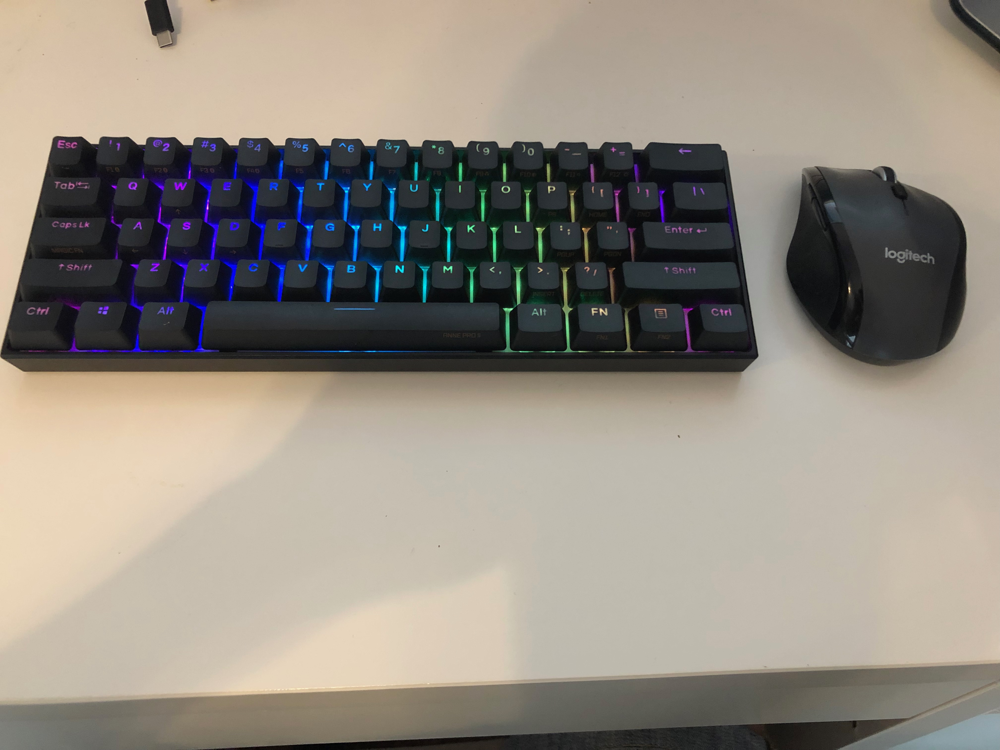
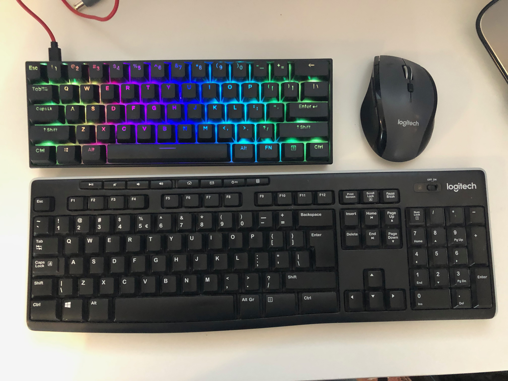
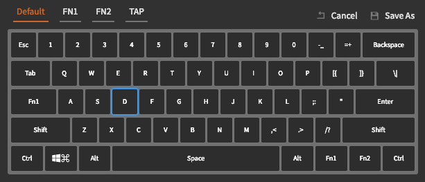
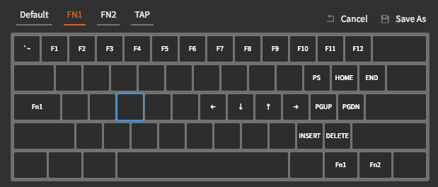
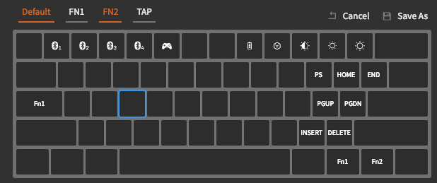
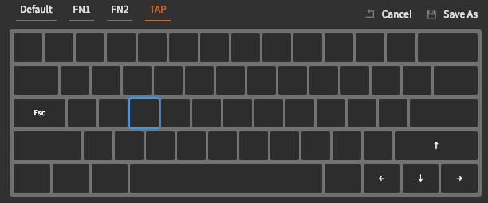

# 4 - PL — Publiczna miłość do prywatnej Anki — czyli jak rozpoczęła się moja przygoda z mechanicznymi klawiaturami.

W tym wpisie chciałem opisać wrażenia korzystania z klawiatur mechanicznych, w szczególności mojej pierwszej — Anne Pro 2.
Wpis rozpocznę, od wyjaśnienia co mnie skłoniło, do wypróbowania klawiatury o mechanicznych przełącznikach i dlaczego zdecydowałem się rozpocząć swoją przygodę dokonując takiego, a nie innego wyboru. Następnie poświęcę więcej uwagi gościowi dzisiejszego wpisu, a mianowicie Anne Pro 2.

## Każda przygoda ma swój początek.
Nigdy nie byłem _wymagającym_ programistą. Ważne było dla mnie, abym mógł tworzyć nowe funkcjonalności i oprogramowanie. Nie poświęcałem za wiele uwagi na **narzędzia**, jakimi pracowałem. Podsumować mnie można było stwierdzeniem _nie ważne, na czym piszesz, ważne, by pisać_. Nie potrzebowałem nowego laptopa co rok czy dwa, wymieniałem je, wtedy kiedy były przestarzałe. Dodatkowo nie przykładałem w ogóle uwagi do urządzeń, które odpowiedzialne są za _rozmowę_ z samym komputerem, mianowicie chodzi o mysz i klawiaturę i tak oto w pracy przez 4 lata używałem klawiatury [Dell KB2016-B](https://www.x-kom.pl/p/338132-klawiatura-przewodowa-dell-kb216-b-quietkey-usb-czarna.html) dostarczanej przez pracodawcę oraz myszki Logitech, którą uratowałem przed utylizacją u poprzedniego pracodawcy — i tak, zamiast zostać zutylizowaną służyła mi dzielnie przez 8 lat, mam ją nadal z sentymentu. 
W domowym zaciszu, po godzinach, rozwijałem swoje prywatne projekty programując dla przyjemności na [Logitech K120](https://www.x-kom.pl/p/595519-zestaw-klawiatura-i-mysz-logitech-mk295-silent-wireless-grafitowy.html?gclid=Cj0KCQjwjo2JBhCRARIsAFG667WU4DZJvWrZwy5ZwYmpToKki_YSU61P93YgSsLhsXl5EhbARh3vBzkaArH8EALw_wcB) w wersji bezprzewodowej — mam małe biurko i chciałem pozbyć się kabli.

### Złe dobrego początki
Niestety jak łatwo się domyślić, pracując osiem godzin dziennie na etacie, a następnie wieczorami dla przyjemności co dawało sumarycznie około 10 - 11 godzin dziennie — głównie pisząc. Mój organizm zaczął się buntować. Zaczęły boleć nie palce, nadgarstki a napisanie więcej niż dwóch linijek ciągłego tekstu było dla mnie nie lada wyzwaniem. Ból palców podczas pisania zaczął mi odbierać radość z samego programowania. Pierwsza myśl, jaka przyszła mi do głowy, zaraz po systematycznym rozciąganiu palców, to iż moja klawiatura się po prostu zużyła. Zrobiliśmy zatem w zespole wielki test klawiatur — jako że każdy z nas miał dokładnie taki sam model, standard pracodawcy. Rozpoczęliśmy testowanie  poprzez pisanie tego samego tekstu na różnych klawiaturach. Okazało się, że moja klawiatura jest _najtwardsza_ i pisze się na niej jakby bezpośrednio uderzało się w blat stołu. Zgadzałoby się z jej wiekiem, była ona najdłużej w zespole.

Zawnioskowałem zatem o nową, którą otrzymałem po kilku dniach. Ku mojemu uradowaniu ból znikł... Na 3 miesiące... Po 3 miesiącach znów zrobiliśmy test i okazało się, iż mój sprzęt znów się zużył. Tym razem miałem już pewność, iż to nie wiek samego urządzenia a po prostu ja. Stało się pewnym, iż aby pozbyć się bólu muszę wymyślić inne rozwiązanie niż wymiana klawiatury co 3 miesiące.

### Mechaniczne przełączniki — nowa nadzieja
Zacząłem zgłębiać wiedzę dotyczącą samych klawiatur i ku mojemu zdumieniu okazało się ze istnieje coś takiego jak **Klawiatura Mechaniczna**. W której każdy klawisz jest wyposażony w przełącznik mechaniczny wytrzymujący kilkukrotnie dłużej niż używane przeze mnie do tej pory klawiatury membranowe tj takie które pod klawiszem mamy membranę taką jak między innymi w pilotach do telewizora. 
Pierwsza myśl: Skoro są kilkukrotnie wytrzymalsze, to wystarczą mi na dłużej! Zacząłem więc zgłębiać temat **mechanicznych klawiatur**. I ku mojemu zdumieniu okazało się, iż kiedyś były tylko takie, mechaniczne, nie było natomiast membranowych. Niestety obniżanie kosztów produkcji doprowadziło do wytworzenia znanych nam klawiatur membranowych — które są znacznie tańsze w produkcji. 

Ciekawostką jest fakt, iż zachodzi tu dokładnie ta sama prawidłowość co w branży zegarkowej. Niegdyś na świecie istniały tylko zegarki mechaniczne, następnie wynaleziono czasomierze kwarcowe, których produkcja była po prostu tania a poziom skomplikowania znacząco mniejszy. Zegarki kwarcowe wyparły z produkcji masowej zegarki mechaniczne, tak jak to miało miejsce w przypadku klawiatur. Warto nadmienić jednak, że w ostatnich latach zegarki mechaniczne powracają co łask, jako zegarki z duszą, a ich ceny zaczynają gwałtownie szybować w górę. 

### Wymagania co do sprzętu
Zapadła decyzja, **kupuję klawiaturę mechaniczną** jednak miałem pewne kryteria co do niej:
- Brązowe przełączniki
	Wybrałem brązowe przełączniki jako te pomiędzy czerwonymi i niebieskimi. Na dzień dokonywania zakupu nie miałem takiej świadomości odnośnie przełączników jak dziś. Wiedziałem jedynie, że czerwone są dla graczy — gdyż nie klikają po wciśnięciu, są liniowe (ang. linear switches), niebieskie natomiast zalecane są dla pisarzy, pracujących w samotności ze względu na ich głośny klik (ang. clicky switch) oraz brązowe będące opcją pośrednią (ang. tactile switch), przy których występuje odczucie kliknięcia przycisku.
- Bluetooth
	Nie chciałem kolejnych przewodów, zatem klawiatura musiała mieć możliwość pracy na baterii przez bluetooth.
- Podświetlenie
	Z racji, iż pracowałem w domu wieczorami, czasami w ciemnym pomieszczeniu pomyślałem, że podświetlane klawisze pomogą mi w szukaniu klawiszy. 
	Niestety muszę tu zaznaczyć, iż mimo że podświetlenie wieczorem wygląda obłędnie, nie używam go... Okazało się, że łatwiej jest mi nie patrzeć na klawisze, pisać bezwzrokowo a co więcej problem słabego oświetlenia rozwiązałem porządną [lampką biurkową](https://ergodesk.com.pl/produkt/lampka-biurkowa-led-10w-na-biurko-z-klipsem/?utm_source=SalesIntelligence&utm_medium=cpc&utm_campaign=SI_138897&utm_content=3090&gclid=Cj0KCQjwjo2JBhCRARIsAFG667XiHgN0DKs_gXnBhZGtchVxG35Gjr0OlkyDRSRQobCn_R3AJ1ZjyD8aAiv1EALw_wcB), która dzięki długiemu ramieniu znajduje się bezpośrednio nad monitorem w myśl tak zwanych monitor light bar. Wszystkie moje następne klawiatury nie mają podświetlenia, gdyż go nie potrzebuje.
- Rozmiar 60%
	Czas wyboru nowej klawiatury zbiegł się z moim zauroczeniem vimem oraz w związku z moimi bolącymi palcami próbą optymalizacji mojej ergonomii pracy. Jedną z podstawowych zasad w vimie jest zaprzestanie używania myszki oraz strzałek, pozwalając tym samym, aby dłonie spoczywały na klawiaturze a same palce na tzw. home row czyli środkowym wierszu klawiatury. _Odnośnie samego Vim’a planuje osobny cykl postów, zatem nie mogę na chwilę obecną zdradzać za dużo._
	Klawiaturę o rozmiarze 60% najprościej wyobrazić sobie jako część na lewo od strzałek, bez klawiszy funkcyjnych. Szczegóły można znaleźć pod [linkiem.](https://deskthority.net/wiki/60%25)
- Cena
	Nie ukrywam, iż cena również odgrywała tu dość istotną rolę. Klawiatury mechaniczne do tanich nie należą, ja natomiast nie miałem doświadczeń z żadną. Obawiałem się, że zainwestuje w bardzo drogi produkt, a finalnie on nie rozwiąże moich problemów.

### Rozważane modele 
Biorąc pod uwagę wszystkie z powyższych wymagań, wyróżniłem dwóch kandydatów do zakupu:
- [Ducky One 2 Mini RGB](https://www.duckychannel.com.tw/en/Ducky-One2-Mini-RGB)
- [Anne Pro 2](https://www.hexcore.xyz/annepro2)

Funkcjonalności bardzo podobne, jednak Anne Pro 2 jest sporo tańsza, a jak pisałem w poprzednim akapicie, cena również odgrywała to znaczącą rolę.  Co więcej Ducky One nie łączności bluetooth. 

### Decyzja zapadła
W końcu zapadła ostateczna decyzja, po dokonaniu przeglądu ofert na rynku zdecydowałem się, iż zamówię ja z Chin, gdyż ta opcja wychodzi zdecydowanie taniej, niż zamawianie od Europejskich pośredników. W dniu zamawiania żadna z rozważanych klawiatur nie była dostępna na rynku Polskim. Zatem wybrałem najkorzystniejszą ofertę i zamówiłem swoją _Anne Pro 2_ ze sklepu [Bangood](https://www.banggood.com/custlink/KGGR0VkT32).

### Gwiazdka pod koniec wakacji
Po około półtora miesiąca od daty zamówienia Kurier dostarczył mój _prezent_. Nie czekając ani chwili pobiegłem ja rozpakować i podłączyć.
Tak o to prezentowała się 5 minut po wyjęciu z pudełka. Musicie wybaczyć jakość, brak ułożenia i artystycznego polotu — nigdy bym nie pomyślał, że przyjdzie mi pisać wpis na bloga o tej klawiaturze.
 

Tak natomiast wyglądała w porównaniu z moją _Logitech K120_

Pierwszym co zrobiło na mnie wrażenie po wyjęciu z pudełka to waga samej klawiatury. Waży ona nieco ponad 600 gram, co w porównaniu do klasycznej klawiatury membranowej stanowi przepaść. Przypomniał mi się, filmik krążący w internecie gdzie jedna osoba łamie klawiaturę uderzając drugą w głowę. Pewne jest, że mimo niewielkich rozmiarów samej klawiatury nie chciałbym oglądać analogicznego filmiku, mogłoby to się skończyć tragicznie.
Klawiaturę podłączyłem kablem USB — C do komputera, nie chciałem tracić czasu na podłączanie przez Bluetooth, chciałem jak najszybciej zacząć pisać. Zasiadłem przed ekranem monitora, przymierzyłem się i od razu spostrzegłem, iż sam profil klawiatury jest inny, przyzwyczaiłem się do wyspowych lub względnie płaskich klawiatur, myśle ciekawe czy będzie to przeszkodą i…

**Zaczęło się…**

Z każdym kolejnym wciśnięciem klawisza, mój uśmiech powiększał się rozciągając się do granic możliwości już po pierwszym zdaniu.
Moje palce powoli przesuwały się — a raczej płynęły po klawiaturze dając uczucie nieukrywanej satysfakcji. Gdy zacząłem pisać jedyne czego się obawiałem to fakt, że będę musiał przestać… Dopiero po chwili doszło do mnie, że wpływ na moją ocenę ma nie tylko samo czucie klawiatury, ale również jej dźwięk, w klawiaturach membranowych zazwyczaj jedyne co słyszeliśmy to uderzanie plastiku o plastik, tu dźwięk był głęboki, przywodził mi na myśl tłumione wystrzały z broni palnej. Podsumowując… Spróbowałem raz i zdałem sobie sprawę, że już nie chcę wracać do poprzedniej klawiatury — Logitech K120. Mógłbym rozwodzić się, opisując poszczególne elementy w różnorodnych epitetach, jednak… Nie jestem pisarzem, tylko programistą. Krótko pierwszy raz poczułem poważną radość z samego pisania… Było to uczucie bardzo podobne do tego, które towarzyszyło mi podczas kompilowania i uruchamiania pierwszego programu, jaki napisałem w podstawówce. **POLECAM** każdemu spróbować i się przekonać. W moim przypadku mechaniczne klawiatury spodobały mi się tak bardzo, iż po pewnym czasie zacząłem je sam budować, ale to historia na zupełnie inny wpis.
Poniżej prezentuje filmik nagrany dnia, kiedy _Anne Pro 2_ do mnie dotarła.

[ Anne Pro 2 - test pisania po rozpakowaniu ](https://youtu.be/2EF1mnwJGzc)

Podsumowując… Spędziłem z _Anne Pro 2_ około 2000 godzin i nie żałuje żadnej z nich (klawiatura sama liczy czas). Po tym czasie klawiatura brzmi nadal, tak jak brzmiała pierwszego dnia. Jedynie co się w niej zmieniło, że nabrała ona więcej kolorów — zmieniłem klawisze funkcyjne na kolorowe zamienniki dołączone w zestawie. Ponadto mimo czyszczenia co jakiś czas pomiędzy klawiszami widoczna jest szara warstewka kurzu. Klawiatura podczas nieużywania leży po prostu na biurku. Nie chowam jej nigdzie, zawsze czeka na mnie w pogotowiu. Gotowa zacząć wspólną przygodę, jaka jest choćby pisanie tego wpisu na bloga. Moim zdaniem niestosownym byłoby pisać ów wpis na innej klawiaturze niż bohaterka naszego wieczora. 

Poniżej filmik nagrywany podczas pisania tego wpisu, przy 2000 h spędzonych na _Anne Pro 2_, za każdym razem jak na niej pisze czuje jakbym, robił to pierwszy raz. 

[Anne Pro 2 - test pisania po 2000h](https://youtu.be/o_JjdYjP-pQ)

### Anne Pro 2 - Zalety
Chciałem zaprezentować zalety _Anne Pro 2_ gdyż jak się okazało część moich wymagań przed zakupowych nie odgrywa już kluczowej roli.

Z zalet oczywistych które jedynie się potwierdziły:
- Niesamowite uczucie pisania na brązowych przełącznikach
- Łączność Bluetooth 
- Kompaktowy rozmiar
- Trwałość

Natomiast _Anne Pro 2_ zaskoczyła mnie w sposób nieoczekiwany… Poniżej prezentuje kilka kluczowych funkcjonalności które okazały się być dla mnie bardzo istotne z biegiem czasu.

#### W pełni programowalna
_Anne Pro 2_ jest w pełni programowalną klawiaturą. Oznacza to, tyle że każdemu fizycznemu klawiszowi możemy przyporządkować dowolną _akcję_. Krótko — chcesz, aby *Capslock* od danej chwili stał się *Esc*, to nie ma problemu. Zamiast cyfr zapragniesz mieć symbole. Nie ma problemu, 4 minuty z oprogramowaniem dedykowanym _Anne Pro 2_ i możesz to osiągnąć. Wyobraźnia jest jedynie twoim ograniczeniem, możesz tak dostosować sobie tą klawiaturę do swojego stylu pracy, jak tylko zapragniesz. 

#### Klawisze o podwójnym przeznaczeniu
Funkcjonalność ta zmieniła mój sposób postrzegania wszelakich klawiatur… W standardowej klawiaturze mamy 104 klawisze, nasze dłonie czasem muszą skakać po połowie biurka, by wydać odpowiednie polecenia. Czemu by nie zmniejszyć ilości klawiszy… Stąd mój pomysł na 60% rozmiar klawiatury. _Anne Pro 2_ wspiera _**Tap mode**_. Oznacza to, iż możemy każdemu klawiszowi przyporządkować dwie akcje.
Pierwsza akcja odpalana jest po wciśnięciu i natychmiastowym puszczeniu klawisza — Tak zwanym _Tapnięciu_. Idealnym przykładem są tu wszystkie klawisze alfabetu, które to wciskamy, aby napisać literę.
Jenak, gdy przytrzymamy klawisz ułamek sekundy dłużej, a w tym czasie naciśniemy inny klawisz… Nasz trzymany zmienia się w klawisz funkcyjny. 

W mojej _Anne Pro 2_ mam przedefiniowany wspomniany wcześniej *Capslock* na *Esc* zatem za każdym razem, gdy wcisnę *Capslock*  do komputera wysyłany jest klawisz *Esc*. Natomiast gdy przytrzymam ów klawisz *Esc* i nacisnę *J* - do komputera przesyłany jest sygnał strzałki w dół. 
Jako, iż _Anka_ nie ma strzałek ustawiłem je zgodnie z mapowaniem *Vima*. *H-J-K-L* przy przytrzymanym klawiszu *Esc* to odpowiednio - *Lewo-Dół-Góra-Prawo*.
Wydaje się skompilowane? Początkowo też tak myślałem jednak, ile razy w swoim _IDE_ podczas podpowiadania składni musiałeś przenosić rękę z Home Row na strzałki aby wybrać trzecią opcje z menu? Często co? W moim przypadku wystarczy, iż trzymając wygodnie dłonie w domyślnym ułożeniu małym palcem lewej dłoni przycisnę przycisk o jeden w lewo od jego naturalnego położenia i wskazującym palcem nacisnę *J* które magicznie zmienia się w strzałkę w dół… Dla mnie **Killer feature!**

#### Warstwy 
Warstwy z angielskiego layers, to przypisane innego znaczenia klawiszowi po uprzednim zastosowaniu modyfikatora w postaci innego klawisza. Pisałem o nich w poprzednim podpunkcie jednak nie wprost, gdyż tam klawisz miał podwójne znaczenie. Najprościej wyjaśnić to na przykładzie klawisza *Shift*. Gdy piszemy — znaki alfabetu pisane są małymi literami, jednak gdy chcemy napisać wielką literę naciskamy *Shift* i jej mały odpowiednik, natomiast na ekranie drukuje się nam wielka litera. _Anka_ podobnie radzi sobie z klawiszami *F1* - *F12*, których fizycznie nie posiada. Wystarczy nacisnąć odpowiedni modyfikator — w moim przypadku sławny *Esc*, a następnie każdy klawisz numeryczny odpowiada klawiszowi funkcyjnemu.

#### Oprogramowanie
Polecam aplikację [ObinsKit](https://www.annepro.net/page/custom/software-downloads), która pozwala na wszystkie konfiguracje naszej _Anii_. Pozwala ona śledzić ilośc godzin spędzonych używając klawiatury, czy modyfikować ją do woli.

### Anne Pro 2 - wady
Każdy produkt ma wady, niestety _Anne Pro 2_ również. Jednak każdemu produktowi życzę tego typu wad, nie innych.

- Aktualizacja kasuje licznik godzin spędzonych z klawiaturą
	_Anka_ posiada licznik godzin pracy, co moim zdaniem jest świetne, aby móc sobie zobrazować skalę jak dużo spędzamy czasu przy komputerze oraz wraz ze wzrostem liczby godzin, poczucie winny po wydaniu większej ilości pieniędzy zdaje się zanikać zupełnie. Niestety pewne aktualizacje oprogramowania, resetowały licznik godzin. Przez co obecnie mam około 630 h  przy tak naprawdę spędzonych około 2000h. 
	Muszę tu jednak przyznać, iż przed aktualizacją oprogramowania zostałem poinformowany o kasowaniu się licznika.
- Problem z połączeniem przez Bluetooth.
	O tyle o ile z moim MacBook Pro z 2020 _Anne Pro 2_ łączy się zawsze, o tyle z firmowym Dellem, na którym pracuje Windows 10 już nie zawsze. Inaczej, zawsze gdy się uprę, finalnie podłączę ją bezprzewodowo, nie zawsze jednak mam chęć i czas. _Anka_ może sparować się z 4 urządzeniami, w moim przypadku są to MacBook, iPhone, iPad, Dell. I muszę przyznać, iż tylko z tym pierwszym działa to bajecznie, w drugiej kolejności pod względem łatwości łączenia plasuje się iPad. Nigdy nie zdażyło się tak, iż mimo mojego uparcia nie byłem w stanie się podłączyć.  Kilkukrotnie nawet pracowałem na dwóch urządzeniach, przełączając się płynnie między nimi, jednak takie rozwiązanie jest po prostu niewygodne dla mnie.

## Moja konfiguracja
### Warstwa Default
Tak jak wspomniałem w zaletach _Anne Pro 2_ jest w pełni programowalna, chciałbym zatem pokazać wam swój układ, który mi pasuje.
Pierwszą warstwą jest warstwa domyślna, widoczna poniżej. Na niej mam podstawowe przyciski.

Główne modyfikacje, jakich dokonałem to zmiana klawisza *Capslock* na *Fn1* który to po wciśnięciu przenosi nasz do warstwy oznaczonej tą samą nazwą. Prawa dolna część to powtórzony klawisz *Fn1* oraz *Fn2*, który daje dostęp do warstwy drugiej.
### Warstwa Fn1
Warstwa do której mamy dostęp po wciśnięciu i przytrzymaniu guzika oznaczonego *Fn1*. W moim przypadku jest to *Capslock* oraz drugi klawisz na prawo od spacji. Warstwa *Fn1* widoczna na rysunku daje mi przede wszystkim dostęp do strzałek, zgodnie z mapowaniem _Vima_ oraz innych klawiszy funkcyjnych, które mam nieopodal strzałek. Dzięki takiemu rozwiązaniu drobny ruch najmniejszym palcem lewej dłoni daje mi dostęp nawigacji, jak i najbardziej kluczowych klawiszy funkcyjnych.
 
Warto zaznaczyć, iż _Anne Pro 2_ zmienia rząd numeryczny w rząd klawiszy funkcyjnych. Dla przykładu, jeżeli chcemy wcisnąć *F5* wystarczy wcisnąć *Capslock*, a następnie *5*. Wydaje się skomplikowane jednak sam ruch jest na tyle niewielki, że można wykonać go znacznie szybciej niż fizyczne przeniesienie dłoni nad rząd klawiszy funkcyjnych i jej powrót.

### Warstwa Fn2

Warstwa techniczna. Zdefiniowane na niej są urządzenia do łączenia przez Bluetooth, stan baterii, jak i podświetlenie. 

### Warstwa Tap

Warstwa Tap - czyli krótkich kliknięć — W moim przypadku klawisz *Capslock* po kliknięciu jest równoważny z *Esc*, natomiast jego przytrzymanie zmienia warstwę na *Fn1*. Prawy dolny róg to klawisze kierunkowe, których używam najczęściej do przewijania wideo, co mogę robić jedną ręką. 

## Podsumowanie
Czy warto? Moim zdaniem **TAK!**
Natomiast Tobie radzę po prostu spróbować, zapewne masz znajomego/znajomą, która ma mechaniczną klawiaturę lub ktoś w twoim mieście/wsi taką dysponuje. Zapytaj o możliwość przetestowania, jeżeli ktoś jest dobrym człowiekiem, po prostu się zgodzi. Moja _Anka_ ma na koncie dwie osoby, które chciały sprawdzić, czy _mechaniki_ są dla nich. Pierwsza z nich ma siostrę bliźniaczkę mojej _Anne Pro 2_, gdyż była tak zachwycona samą klawiaturą, jak i przełącznikami, że wybrała dokładnie ten sam model z tego samego sklepu. Druga, natomiast przekonała się do mechanicznych klawiatur i, mimo iż zdecydowała się finalnie na klawiaturę mechaniczną od Logitech’a, to chwali sobie dzień, w którym odważyła się potestować przez jeden dzień moją pierwszą :)

Czy polecam _Anne Pro 2_? **ZDECYDOWANIE!**
Mnogość zalet sprawia, że obecne wady po prostu bledną i nie stanowią problemów. Czy kupiłbym ją raz jeszcze? Tak! Komu polecam? Każdemu, gdyż jest ona bardzo wszechstronna, a mnogość funkcji zadowoli każdego. W internecie szczególności w polskich sklepach przedstawiana jest jako klawiatura gamingowa - co moim zdaniem jest krzywdzące — chodzi mi o szufladkowanie jej w tej kategorii. Jest to po prostu kawał dobrego, ciężkiego, profesjonalnego sprzętu, który odwdzięczy się każdemu, kto spędza znaczące ilości czasu przy klawiaturze.

Pozdrawiam,
amidevtech