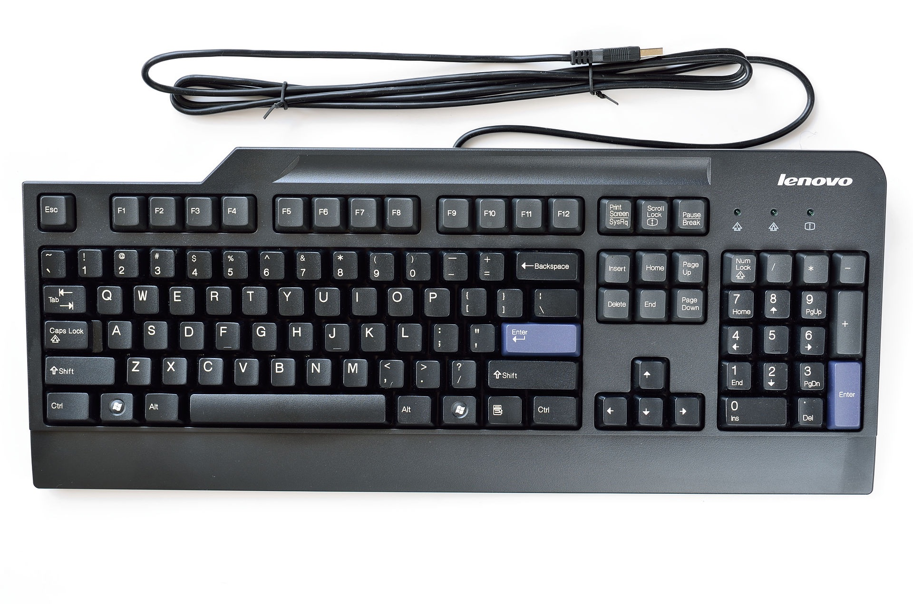
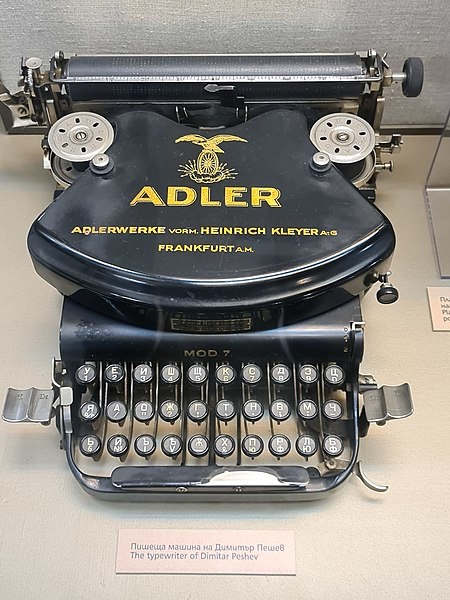
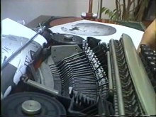
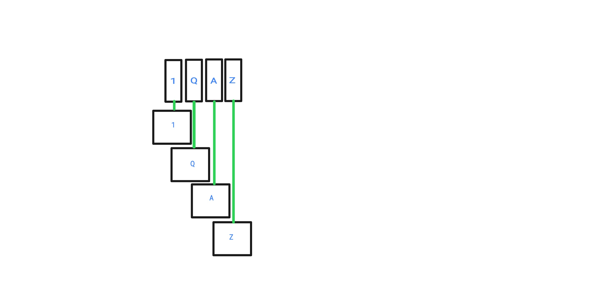
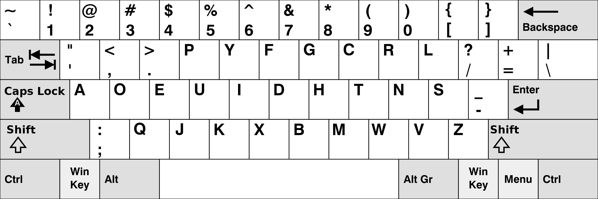
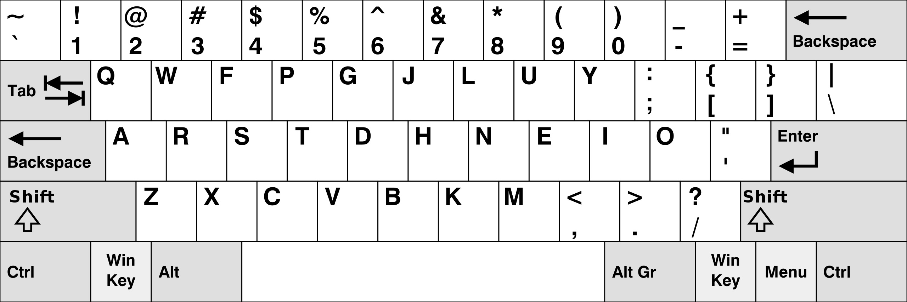
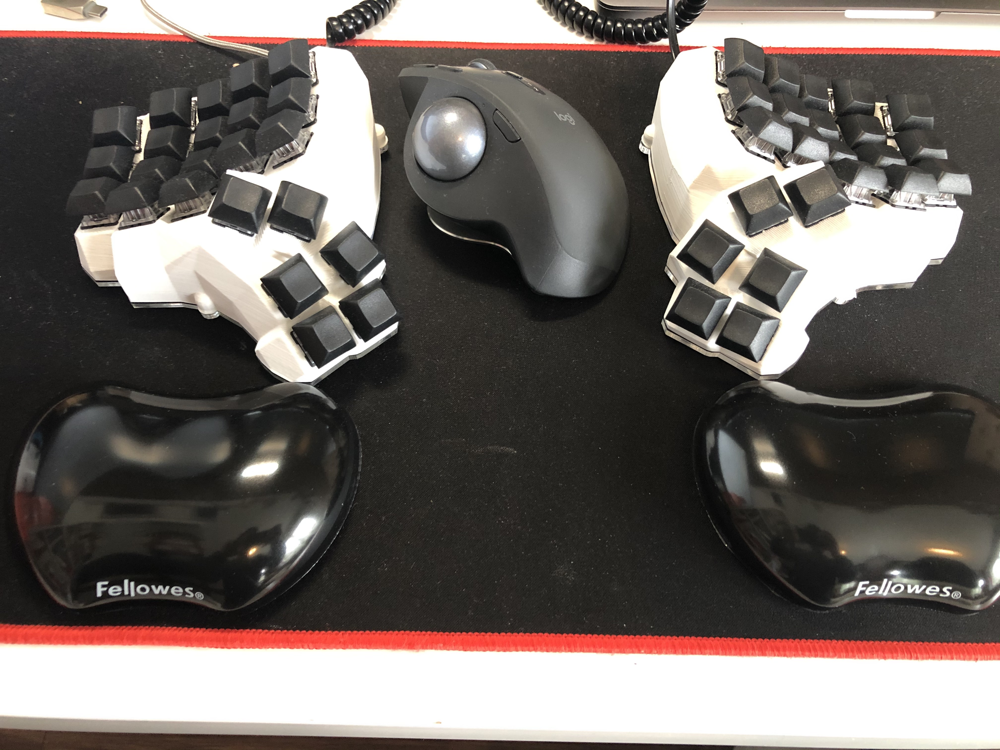
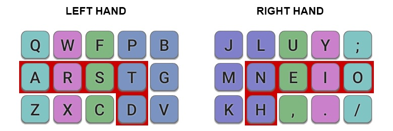

# Dlaczego Twoja standardowa klawiatura może nie być odpowiednia dla Ciebie
 Czy zastanawiałeś się kiedyś nad decyzjami jakie stały za projektem współczesnej _klawiatury_? Znaczy, dlaczego wygląda ona tak a nie inaczej, dlaczego kolejne wiersze są przesunięte w prawo? Drugim pytaniem jakie ciśnie się na usta to dlaczego litery są ułożone w takiej a nie innej kolejności. Co przyświecało projektantom przy podejmowaniu takich a nie innych decyzji. To prowadzi nas do tematu dzisiejszego wpisu.

## Mały wstęp
Jak zapewne przypuszczasz, _maszyny do pisania_ są przodkami dzisiejszych _klawiatur_. Naturalnie funkcjonalność _klawiatur_ została dostosowana do naszych czasów jednak w porównaniu do _maszyn do pisania_ sam układ klawiszy nie zmienił się prawie wcale co można zaobserwować na zdjęciach poniżej:

[Klawiatura](https://en.wikipedia.org/wiki/Computer_keyboard#/media/File:LenovoKeyboard.jpg)

[Maszyna do pisania](https://en.wikipedia.org/wiki/File:Typewriter_%22Adler%22.jpg)

_Nowoczesne klawiatury_ a raczej _klawiatury_ gdyż tak będę nazywał te elektryczne urządzenia z obecnych czasów, są ewolucją _maszyn do pisania_. Gdy popatrzymy na zdjęcia powyżej, główna część _klawiatury_ składa się z liter umieszczonych w trzech wierszach, gdzie każdy kolejny jest nieco przesunięty w prawą stronę względem poprzedniego. Na dole mamy długi przycisk zwany _spacja_. Naturalnie, _klawiatura_ ma więcej klawiszy, gdyż zostały one dodane w procesie ewolucji _maszyny do pisania_. Dodatkowo została ona wyposażona w klawisze funkcyjne, strzałki kierunkowe jak i klawisze numeryczne po prawej stronie.

## Przesunięcie wierszowe
Pierwszą rzeczą jaka rzuca się w oczy gdy patrzę na _klawiaturę_ jest fakt, iż nie ma oba kolumn. Każdy kolejny wiersz poczynając od górnego jest przesunięty w prawo, co nazywa się **przesunięciem wierszowym**. Kiedyś usłyszałem takie wyjaśnienie. To przesunięcie w prawo jest powodowane długością klawisza _Shift_. Muszę przyznać, iż to całkiem ciekawe wyjaśnienie jednak oczywiście jest ono nieprawdziwe. Drugim, uraczył mnie mój kolega, twierdząc, iż jest to podyktowane _ergonomią_, niestety nie był w stanie wyjaśnić jak to ma na nią wpłynąć. Podsumował swą wypowiedz następującymi słowami „Musi być jakiś powód, moim zdaniem ergonomia.” Prawdę mówiąc nie dostrzegam niczego ergonomicznego w tym przesunięciu co więcej istnieje dużo badań potwierdzających iż to nie ma z tym nic wspólnego.
Zatem? Dlaczego _klawiatury_ mają **przesunięcie wierszowe**? Pozwól, że wyjaśnię poprzez umieszczenie raz jeszcze zdjęcia _maszyny do pisania_.

[Maszyna do pisania](https://en.wikipedia.org/wiki/File:Typewriter_%22Adler%22.jpg)

Zdjęcie to wybrałem celowo aby ukazać występującą w nim zależność. _Maszyny do pisania_ zostały wyposażone w mechanizm gdzie pojedyncze naciśnięcie klawisz, uruchamia tak zwany _młoteczek_ uderzający w kartkę papieru. Najważniejsza część urządzenia umieszczona jest w górnej części maszyny, gdzie wszystkie litery zostały ułożone jedna za drugą w jednym rzędzie, co prezentuje następujące zdjęcie:

[Mechanizm maszyny do pisania](https://upload.wikimedia.org/wikipedia/commons/thumb/0/0c/Typewriter.ogv/440px--Typewriter.ogv.jpg)

Części odpowiedzialne za drukowanie liter ułożone są w jednym rzędzie i uderzają papier gdy są aktywowane. Klawisze są znacznie szersze i z tej przyczyny nie jest możliwym aby umieścić je analogicznie w jednym rzędzie. Podzielono zatem litery na trzy rzędy i zastosowane różne długości nóżek łączących same klawisze z głównym mechanizmem. Najpopularniejsze _maszyny do pisania_ mają przesunięcie w kolejnych wierszach o 1/4 długości klawisza, gdyż mamy 4 rzędy klawiszy. Rząd numeryczny jak i trzy rzędy z literami. Dzięki takiemu zabiegowi konstrukcja _maszyn do pisania_ jest znacznie prostsza, każda nóżka jest w lini prostej połączona z przyciskiem. Idee przedstawiam poniżej.

Oczywistym jest, iż całość jest nieco bardziej skomplikowana gdy kolejne guziki umiejscowimy obok siebie, kolejne klawisze przykryły by nóżki poprzedzających je klawiszy. Obrazek powyżej prezentuje jedynie idee. Zatem przyczyna szukaną przez nas nie jest decyzja projektowa ułatwiająca pisanie - przyczyną jest ograniczenie technologiczne _maszyn do pisania_, co zostało rozpropagowane na _klawiatury_, które w gruncie rzeczy nie mają tych ograniczeń i mogłby by z powodzeniem być zaprojektowane bez nich.
 
## Układ QWERTY
Drugą rzeczą jest umieszczenie liter w takim a nie innym ułożeniu, co przenosi nas do **układu klawiatury** zwanym _QWERTY_ jako najpopularniejszego. Pierwszym, co musisz wiedzieć jest to dlaczego _QWERTY_ zostało tak zaprojektowane. W pierwszych modelach _maszyn do pisania_ litery na klawiszach były umieszczone alfabetycznie. Niestety jednak, powodowało to problemy, podczas szybkiego pisania szybkie wciśniecie dwóch, umiejscowionych blisko siebie, klawiszy jeden po drugim blokowało _maszynę do pisana_. Jeżeli miałeś możliwość pobawić się prawdziwą _maszyną do pisania_ problem ten powinien być Ci znany. Osobiście miałem taką możliwość jako dziecko, dobrze pamiętam, iż gdy wciskałem dwa klawisze obok siebie, praktycznie w jednym czasie jak **A** i **Q** moja _maszyna_ zacinała się.
_QWERTY_ została zaprojektowana w celu rozwiązania tego problemu. W skrócie, zostały przeprowadzone badania dzięki którym litery w _QWERTY_ zostały ulokowane najdalej jak to możliwe względem siebie. W bardziej techniczny sposób, _maszyny_ zacinały się gdy szybko wciśnięto dwie litery znajdujące się blisko siebie - tak zwane _bigramy_. W języku angielskim, dla takiego układ projektowano, najpopularniejszymi bigramami są:  **th**, **he**, **in**, **en**, **nt**, **re**, **er**, **an**, **ti**, **es**  oraz wiele innych. W tym podejściu, litery najczęściej występujące bigramów nie powinny być ułożone blisko siebie. Tak o to _QWERTY_ powstało, jako układ minimalizujący bliskość liter w najpopularniejszych bigramów w języku Angielskim.

## Skąd ta popularność
Zadziwiony? Ja byłem, gdy się dowiedziałem. Możesz zatem zapytać więc “Skoro te dwie rzeczy są powiązane jedynie z _maszynami_ dlaczego my używamy ich w dzisiejszych czasach?” Odpowiedź jest znacznie prostsza niż mógłbyś oczekiwać. Klawiatury mają obecny kształt i formę ponieważ ludzie przyzwyczaili się do nich. Na początku istnienia komputerów, bardziej znacząca była możliwość szybkiej przesiadki z _maszyny_ na _klawiaturę_. Maszyniści byli zaznajomieni z tym układem, zatem zdecydowano go pozostawić. Istniała już grupa osób która mogła efektywnie używać tych urządzeń. Nie ma za tym żadnej wielkiej teorii, projektanci zdecydowali pozostawić _klawiatury_ takimi jakimi już je znano. To podejście utrzymało się do dnia dzisiejszego. Producenci przykładają więcej uwagi do rzeczy które już znamy niż, ryzykują eksperymentując.

## Niedoskonałości QWERTY 
Zgaduję że nikt nie spodziewał się takiej popularyzacji komputerów, obecnie komputery są integralną częścią naszego życia. 
Co więcej, istnieje wiele zawodów powiązanych ściśle z komputerem, gdzie spędza się około 8 godzin dziennie przed ekranem. Jako społeczeństwo wytworzyliśmy szereg zawodów które nie istniały przed erą IT. Jestem programistą, cały dzień spędzam patrząc w ekran i pisząc kod, który nawet nie istnieje poza komputerem. Piszemy sporo, to jest nasz sposób na komunikację z tymi urządzeniami.

Nie powiedziałbym, że _QWERTY_ jest złe, skłaniałbym się do opinii, iż ma swoje wady, przez które osoby spędzające znaczne ilości czasu przed ekranem komputera mogą odczuwać niedogodności. Napisałem już o dwóch głównych słabych punktach - są to braki w projektowaniu dyktowane ograniczeniami minionych lat. 

### Przesunięcie wierszowe
Wyjaśniłem już przyczynę tego zjawiska, jednak jakie niesie ono ze sobą konsekwencje. Mianowicie, musisz wyginać swoje palce podczas pisania w bardziej nienaturalny sposób. W przeszłości dotyczył mnie ten problem, moje palce bolały gdy pisałem przez dłuższy okres czasu. 

### Układ
Jako że _QWERTY_ zostało zaprojektowane do zwiększenia dystansu pomiędzy literami występującymi w najpopularnieszych bigramach, ogólny *dystans podróży palców* (dystans mierzony pomiędzy następującymi po sobie klawiszami, mierzony w szerokości klawiszy) nie jest optymalny. Najbardziej popularne litery w języku angielskim , **E** i **T** ułożone zostały nie najwygodniejszych miejscach. Jedno jest pewne, można by ten projekt optymalizować.

Dla mnie, osoby która pisze dużo wszystkimi 10 palcami, najlepsze rozwiązaniem było by umieszczenie najczęściej występujących liter na tak zwanym **home row** (środkowym wierszu klawiatury, gdzie palce powinny być ułożone, każdy palec na kolejnym klawiszu.)

## Nowoczesne alternatywne układy
Istnieje kilka **nowoczesnych** alternatyw dla układu _QWERTY_. Najpopularniejszymi są układ _Dvoraka_ i _Colemack_. Poniżej przedstawiam zdjęcia, oraz jedno zdaniowy opis.

#### Dvorak 

Układ _Dvoraka_ w dużej mierze polega na naprzemiennej pracy rąk. Po jednej stronie na **home row** znajdują się samogłoski a najczęściej używane spółgłoski 

#### Colemak

Drugim najpopularniejszym układem klawiatury jest _Colemak_ który jako główne założenie przyjął umiejscowienie najczęściej używanych liter na na **home row** z możliwością łatwego pisania bigramów.
Pisząc ma się uczucie **bujania** z jednej strony klawiatury na drugą. 

## Moja klawiatura
Jako entuzjastą klawiatur miałem możliwość pisania na kilku, co najmniej _dziwnych_, robionych własnoręcznie, mechanicznych klawiaturach. Nie miej jednak chciałem się podzielić moim aktualnym zestawem z Tobą.

Aby pozbyć się problemu _przesunięcia wierszowego_, używam dzielonej klawiatury ortolinearnej. Dzięki temu, moje palce muszą poruszać się jedynie do góry i na dół, bez przesuwania na boki. Mój zestaw składa się z ręcznie lutowanego _Dactyl Manuforma_ oraz _LOgitech MX Ergo_

Jako układu klawiszy, używam _Colemak Mod-DH_ dla klawiatur ortolinearnych. Naprawia on kilka braków _Colemak_.
For keyboard layout, I use _Colemak Mod-DH_ for matrix keyboards. It fixes some original _Colemak_ drawbacks.
Mój układ wygląda następująco:

Czerwoną oblamówka ukazuje klawisze które najprościej jest wcisnąć, co więcej, najczęściej występujące litery umiejscowione są właśnie na tych miejscach.

## Podsumowanie
Biorąc wszystko powyższe pod uwagę, czy powinieneś przesiadać się na ergonomiczną klawiaturę z nowym układem? Odpowiedź brzmi, to zależy. Jeżeli jesteś okazjonalnym użytkownikiem i spędzasz przed komputerem nie za dużo czasu. W mojej opinii nie powinieneś niczego zmieniać. Okres nauki pochłonie Twoje siły i energię, co prawdopodobnie nie jest tego warte… Oczywiście, jeśli chcesz, próbuj śmiało, to może być całkiem dobra zabawa. Po prawdzie mi osobiście nauka nowego układu na nowej klawiaturze przyniosła wiele przyjemności. 
Z drugiej jednak strony, jeżeli twoja codzienna praca jest ściśle powiązana z komputerami i przez większą część dnia piszesz na klawiaturze, sugerowałbym rozważenie zmiany i benefity jakie to ze sobą przyniesie. Zainwestowany czas zwróci się z nawiązką. Czy zaczniesz pisać szybciej? Prawdopodobnie nie, ale zdecydowanie Twoje palce będą Ci wdzięczne za zmianę. Całość ma się analogicznie jak w przypadku ergonomicznych krzeseł, jeśli spędzasz rozsądną ilość czasu siedząc możesz to robić na dowolnym krześle bez uszczerbku dla Twoich pleców. Nie mniej jednak, gdy większość dnia spędzasz siedząc w krześle, sugerowałbym zapatrzenie się w ergonomiczne, Twoje plecy bedą wdzięczne. Biorąc pod uwagę klawiatury, jeżeli Twoja praca składa się z pisania, zachęcam, rozważ zmianę… Twoje dłonie jak i palce podziękują Ci prędzej czy później.

_____
Na dziś to wszystko!
Dziękuje za uwagę.
Najlepszego! 
amidev

