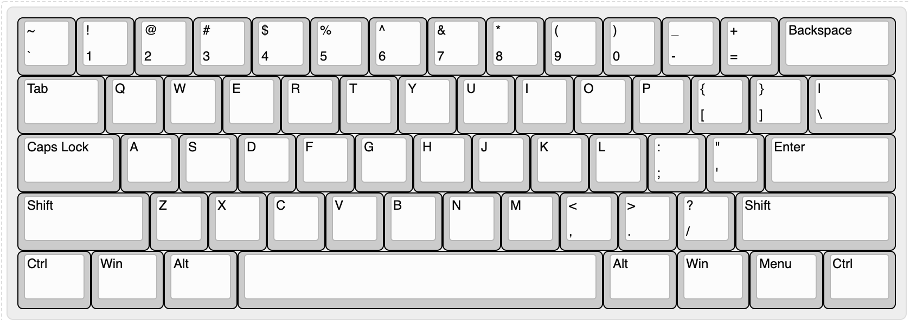

# 6 - Klawiatury Ortolinearne
Ten wpis stanowi pierwszy z serii traktujących o ergonomicznych mechanicznych klawiaturach. Skupię się w nim na takim tworze jak **klawiatury ortolinearne** (ang.: Ortholinear keyboards). Przyjrzymy się ich budowie na przykładzie najpopularniejszego modelu oraz zestawimy ją, porównując ze standardowym układem.
 
# Czy jest klawiatura ortolinearna
Jak zapewne, wiecie standardowa klawiatura qwerty charakteryzuje się _przesunięciem wierszowym_, co pokrótce oznacza, że każdy kolejny wiersz klawiatury jest przesunięty nieco w prawo. To rozwiązanie jest efektem ograniczeń minionych czasów i tak naprawdę nie jest już potrzebna w żaden sposób nowoczesnych klawiaturach. Mój poprzedni artykuł [Dlaczego Twoja standardowa klawiatura Qwerty może nie być odpowiednia dla Ciebie ](https://www.amidev.tech/pl/dlaczego-twoja-standardowa-klawiatura-qwerty-moze-nie-byc-odpowiednia-dla-ciebie/ "Dlaczego Twoja standardowa klawiatura Qwerty może nie być odpowiednia dla Ciebie")szczegółowo opisuje powód wprowadzenia tego rozwiązania oraz jego bezcelowość w dzisiejszych klawiaturach. 

Skoro przesunięcie wierszowe nie jest potrzebne do działania klawiatury, kwestią czasu było pojawienie się modelu, który postanawia go usunąć. Naturalnie ze względu na ogromną popularność _QWERTY_ na układzie z _przesunięciem wierszowym_ klawiatury te nie są mainstreamowe, jednak moim zdaniem stanowią one pierwszy krok w kierunku **klawiatur ergonomicznych** eliminując jedna z 2 głównych cech standardowego układu _QWERTY_. 

Poniżej przedstawiłem klasyczny układ 60% klawiatury, tj. takiej, w której usunięto strzałki, klawisze funkcyjne oraz num pad. Taki układ ma między innymi opisywana przez mnie na tym blogu klawiatura [Anne Pro 2](https://www.amidev.tech/pl/publiczna-miosc-do-prywatnej-anne-pro-2-czyli-jak-rozpoczea-sie-moja-przygoda-z-mechanicznymi-klawiaturami/ "Anne Pro 2").  

Wyobraź sobie, że chcesz usunąć przesunięcie wierszowe. Jedyne co trzeba zrobić, by to osiągnąć to _ścieśnić_ ostatnią lewą kolumnę przycisków nadając im szerokość 1U - (to szerokość jednego standardowego klawisza). W tym konkretnym przypadku klawiszom: _Tab_, _Caps Lock_, _Shift_ należy nadać szerokość, jaką ma klawisz w lewym górnym rogu. Następnie należy wyrównać klawisze do lewej strony układając je w układ macierzowy (ang. matrix layout):

Mam nadzieje, że w Twojej wyobraźni pojawił się układ przypominający obrazek powyżej. Naturalnie ostatnia kolumna prawej strony musiała zostać przeorganizowana, gdyż otrzymany układ to 12 kolumn. Przyznaj proszę drogi czytelniku, iż na pierwszy rzut oka wygląda to nienaturalnie? Przyczyną jest to, prawdopodobnie przez całe życie oglądałeś standardowe klawiatury zawierające _przesuniecie wierszowe_. Może nawet twierdzisz, że na tym zapewne nie da się pisać. To zrozumiałe i statystycznie większość osób jest wyczulona na zmiany i woli zostać przy dobrze znanym układzie. Oto **prawdziwy powód, dlaczego** _QWERTY_ nadal cieszy się taką popularnością. W tym blogu zastanawiamy się jednak nad poprawą jakości naszej pracy, która bezpośrednio związana jest z pisaniem. Musisz przyznać, iż nie wszystko, co popularne jest najzdrowsze i najkorzystniejsze dla nas.

## Klawiatura ortolinearna w praktyce
Zastanówmy się jak na tym mogłoby się pisać. Spróbujemy tu rozważyć to z poziomu teoretycznego, chociaż mam szczerą nadzieję, że dane będzie Ci spróbować pisać na ortolinearnej klawiaturze, gdyż jest to ciekawe doświadczenie. 

Sprawdźmy zatem jak poszczególne palce wpasowują się w układ ortolinearny.

Powyżej przedstawiam szkic dłoni z pokolorowanymi paznokciami na różne kolory, kolory paznokci są symetryczne względem dłoni. Następnie, tymi samymi kolorami zaznaczmy jakie palce są odpowiedzialne za jakie klawisze — rozważamy tu jedynie klawisze z literami. W układzie _QWERTY_ sprawa ma się następująco:

Pierwszym co rzuca się od razu w oczy jest fakt, iż kolumny te są jak nie trudno odgadnąć pionowe. Chciałbym, abyś wykonał proste ćwiczenie, połóż proszę swoje dłonie na klawiaturze w sposób prawidłowy: Palce lewej reki powinny począwszy od najmniejszego palca być ulokowane na klawiszach **A**, **S**, **D**, **F**. Prawej począwszy od wskazującego kolejno: **J**, **K**, **L**, **;**. 
Następnie każdym z palców postaraj się sięgąć do klawiszy o tym samym kolorze. Mogę się założyć, iż o ile nie trenowałeś uprzednio bezwzrokowego pisania 10 palcami, co najmniej kilkukrotnie nie trafiłeś palcem w środek klawisza. Osobiście mam problem z klawiszem **Z**, **X**, **,**, pozostałe też nie dają mi poczucia naturalności ruchu, raczej wyuczenia. 

Sprawdźmy zatem klawiaturę ortolinearną.

Na pierwszy rzut oka widać, iż przypisanie klawiszy do poszczególnych palców wydaje się bardziej naturalne niż w standardowym układzie. Zwróć proszę uwagę, iż pace muszą jedynie poruszać się w górę i dół, co wydaje się zdecydowanie naturalniejsze patrząc na ich budowę. To właśnie zaleta układu macierzowego, zmiana płaszczyzny ruchu na bardziej naturalną budowie palców. 

# Podsumowanie
Czy warto? Moim zdaniem warto, choćby tylko po to, aby się przekonać czy jest to dla nas wygodniejsze. W moim odczuciu jest i jest warte nauki. Sama przesiadka na klawiaturę ortolinearną nie zajmuje długo. Osobiście podszedłem do tego, jak do urozmaicenia sobie dnia pracy, nowym gadżetem. Po kilku dniach czułem się na tyle pewnie, iż schowałem swoją klawiaturę z _przesunięciem wierszowym_ do szafki.

Chciałbym podkreślić jedną rzecz. Sama przesiadka na klawiaturę ortolinearną nie rozwiąże problemów bolących palców ani nie jest definicją ergonomii. Na ergonomie klawiatury składają się dwa czynniki. Pierwszym jest budowa fizyczna samego urządzenia, drugim natomiast jest układ klawiszy.  
Klawiatura ortolinearna stanowi pierwszy krok w pierwszym z czynników.

---- 
Pozdrawiam.
amidev

 

