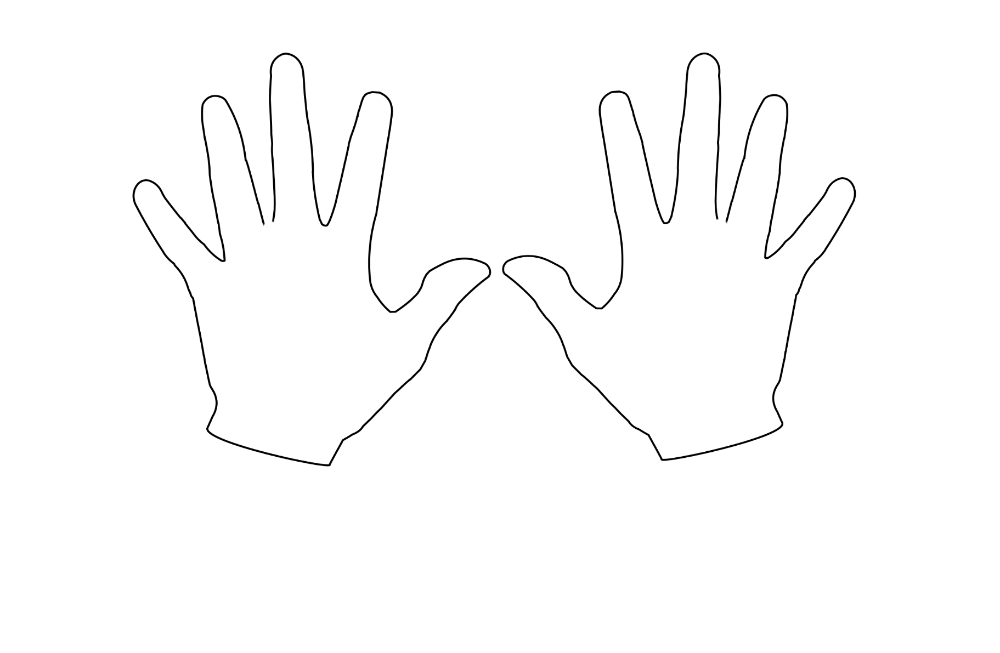
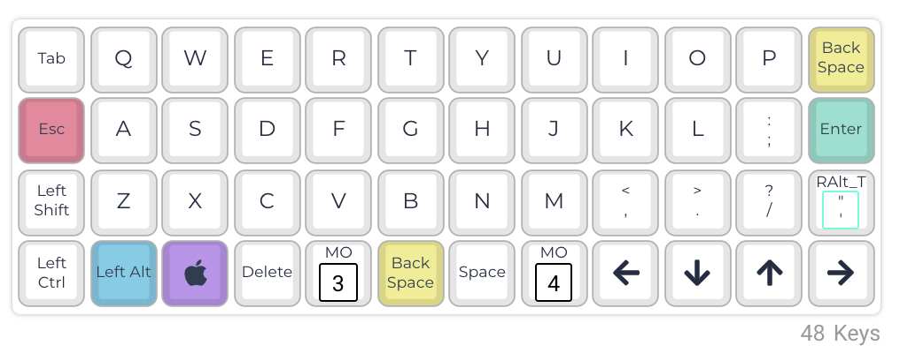
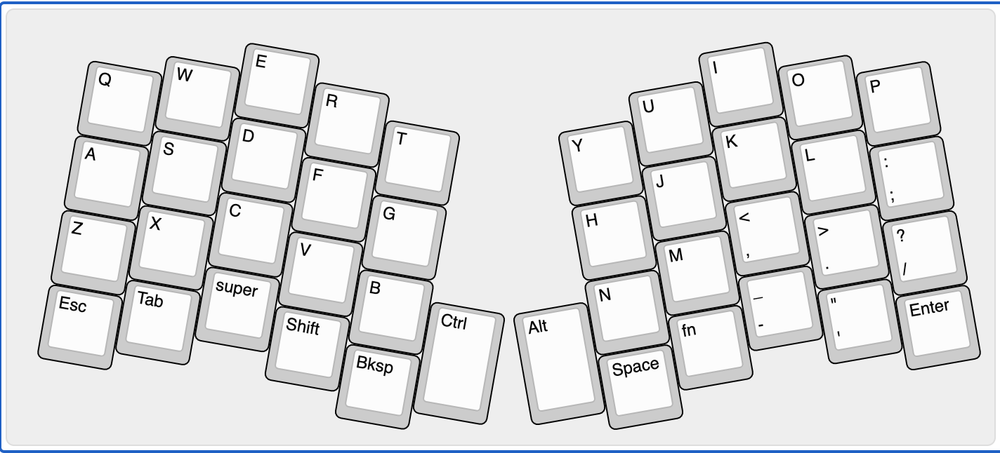
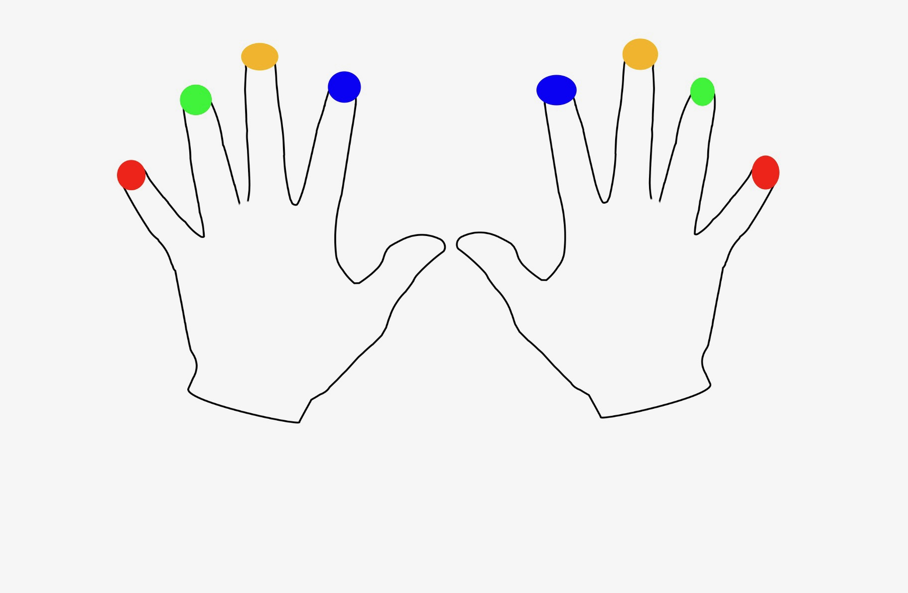
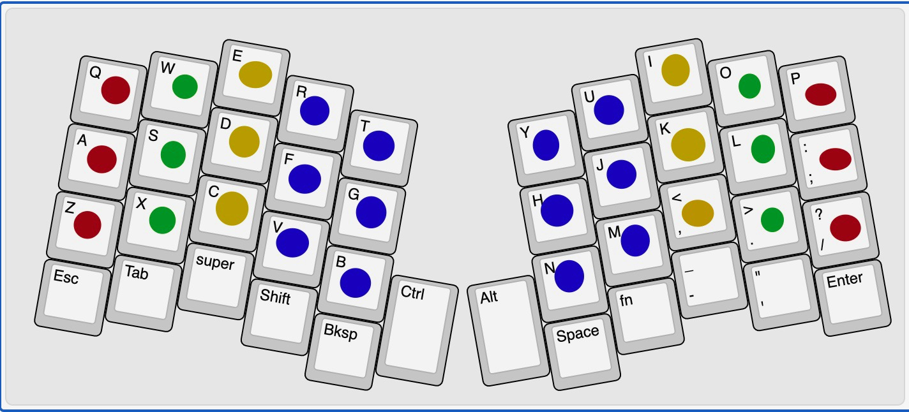
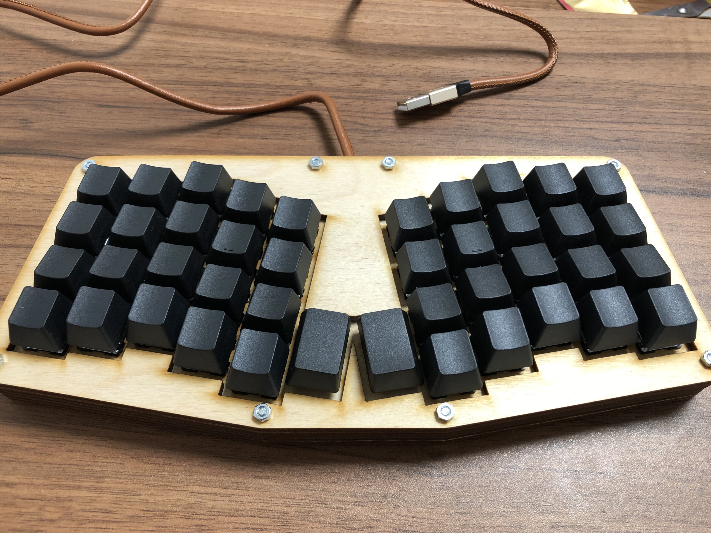
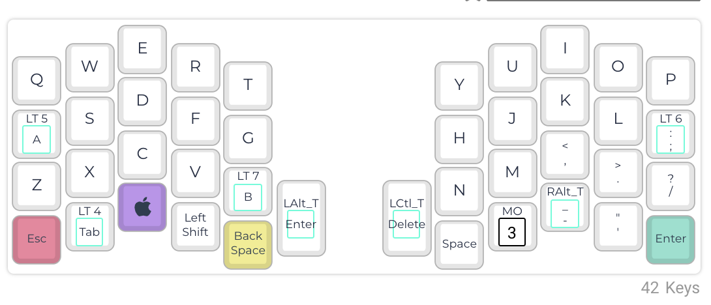

# Klawiatury z przesunięciem kolumnowym

Proprzedni post dotyczący klawiatur ortolinearnych pod tytułem [Klawiatury Ortolinearne](https://github.com/amidevtech/blog/blob/main/pl/posts/6_klawiatury_ortolinearne/index.md) opisywał klawiatury, w których nie występuje przesunięcie wierszowe. Układ ten to krok w stronę ergonomii, jako iż jest on bardziej naturalny i zgodny z budową naszych dłoni, jak i ułożeniem palców. W tym wpisie chciałbym pójść krok dalej niż klawiatury ortolinearne i zastanowić się jak można taki układ klawiatury uczynić jeszcze bardziej przyjaznym dla naszych dłoni dzięki użyciu klawiatury z przesunięciem kolumnowym.
Co to jest _przesunięcie wierszowe_, co było jego przyczyną powstania i dlaczego jest zbędne w nowoczesnych klawiaturach, możesz przeczytać w poście: [Dlaczego Twoja standardowa klawiatura może nie być odpowiednia dla Ciebie](https://github.com/amidevtech/blog/blob/main/pl/posts/5_twoja_klawiatura_nie_jest_odpowiednia_dla_ciebie/index.md).

## Krok dalej
W pierwszej kolejności chciałbym przywołać opisywany w poprzednim poście szkic przedstawiający nasze dłonie.

Oraz _klawiaturą ortolinearną_

Palce dzięki likwidacji _przesunięcia wierszowego_ podczas pisania poruszają się jedynie osi pionowej, co jest zgodne z ich naturą. Jednak co gdyby zrobić krok dalej i uwzględnić kolejną cechę budowy naszych dłoni, mianowicie różną długość placów? Przyzwyczajeni jesteśmy do klawiatur, które mają klawisze ułożone równo w wierszach, jednak gdy zastanowić się nad tym chwilę nie musi wcale tak być. Palce różnej długości ułożone są na **Home Row** w jednej linii, co nie jest do końca naturalne dla naszych dłoni.

Przeprowadź, proszę, test. Rozluźnij dłoń i stuknij wszystkimi palcami jednocześnie w blat biurka czy inną płaską powierzchnię. Po jednym ze stuknięć nie dorywaj dłoni od podłoża i zobacz, jak ułożone są Twoje palce. Czy są w jednej linii? Otóż najprawdopodobniej nie. Środkowy palec znajduje się najwyżej, dwa najmniejsze palce począwszy od serdecznego ulokowane są niżej.

Dlaczego by zatem nie uwzględnić takiej cechy naszych dłoni w klawiaturach? Nie da się? **Da się!**, co prowadzi nas do kolejnej sekcji.

## Przesunięcie kolumnowe

Obrazek powyżej przedstawia klawiaturę zlikwidowanym _przesunięciem wierszowym_ natomiast zastosowanym _przesunięciem kolumnowym_. Każda kolumna tej klawiatury zaczyna się i kończy w innym punkcje przestrzeni. Sama szerokość i wysokość klawiszy jest taka sama, jednak początek i koniec kolejnych kolumn znajduje się w innych miejscach. Gdy przypatrzymy się różnicą w wysokościach kolumn zauważymy analogie z uprzednio przeprowadzonego ćwiczenia. 

W skrócie, gdybyś wykonał ćwiczenie z poprzedniego paragrafu na klawiaturze ortolinearnej zamiast na blacie biurka, najprawdopodobniej, bo zatrzymaniu dłoni na klawiaturze, palce nie leżałyby odpowiednio na klawiszach. To samo ćwiczenie wykonane na klawiaturze z _przesunięciem kolumnowym_ spowoduje, iż palce znajdą się w okolicy środka klawisza, a przynajmniej nie na ich przecięciu. 

Muszę wyjaśnić, iż układ ukazany na poprzedniej grafice również zawiera podział klawiatury na dwie połówki tak zwany **split**, gdzie każda z dłoni ma swój przypisany zestaw przycisków. Dodatkowo klawisze ułożone są pod kątem, a nie jak w układzie ortolinearnym prosto co stanowi — stanowi to kolejny krok w kierunku ergonomii. Nie chcę rozwodzić się nad tym zanadto, gdyż o czym będzie traktował kolejny post.

## Przesunięcie kolumnowe w praktyce
By zobrazować realny wpływ przesunięcia kolumnowego na ergonomię, posłużę się zdjęciem dłoni z kolorowymi końcówkami palców, jest to ten sam obrazek, który został użyty w poście odnośnie [klawiatur ortolinearnych](https://github.com/amidevtech/blog/blob/main/pl/posts/6_klawiatury_ortolinearne/index.md). 

Przypomnijmy, iż tak wyglądało przypisanie klawiszy do poszczególnych palców na _klawiaturze ortolinearnej_:

W analogiczny sposób oznaczyłem klawisze przypisane do poszczególnych palców dłoni w klawiaturze z _przesunięciem kolumnowym_:

Porównując dwa powyższe zdjęcia i odnosząc je do naszych dłoni, stwierdzenie, iż układ z _przesunięciem kolumnowym_ jest bardziej ergonomiczny wydaje się oczywiste. Uwzględnia on różną długość palców, przez co choćby sięgnięcie górnego wiersza najmniejszym palcem, a dolnego palcem środkowym jest znacznie wygodniejsze. 

	Główną ideą stojącą za klawiaturami ergonomicznymi jest odwrócenie całego procesu tworzenia samej klawiatury. Klasycznie najpierw powstał projekt samej klawiatury ze względu na ograniczenia techniczne, następnie próbowano się do niego dostosować. W przypadku klawiatur ergonomicznych w pierwszej kolejności jest adaptacja układu do ludzkiej dłoni, następnie w oparciu o te cechy tworzony jest sama klawiatura. 

Sam musisz sobie odpowiedzieć, które rozwiązanie jest lepsze oraz z którym rozwiązaniem Twoje dłonie chciałby spędzić kolejne lata. 

## Przykład z życia
Teoria, teorią, jednak jak taka klawiatura może wyglądać w rzeczywistości? Prawdę mówiąc, analogicznie do teoretycznego układu przedstawionego powyżej, a mianowicie:

Oto mój **Atreus**, który został zaprojektowany przez _Phila Hagelberga_ oto [strona oryginalnego projektu](https://github.com/technomancy/atreus). Mając listę części, mogłem je skompletować, sam projekt obudowy został wycięty na zamówienie w lokalnym warsztacie stolarskim. **Atreus** to moja pierwsza samodzielnie zbudowana klawiatura, darze ją szczególnym sentymentem, gdyż od niej zaczęła się moja pasja. 

Obecnie można zakupić wersję drugą, która nie jest już klawiaturą robioną własnoręcznie, a produkowaną. Oto [link do sklepu](https://shop.keyboard.io/products/keyboardio-atreus).

### Mój layout 
Dla ciekawskich wrzucam zdjęcie swojego układu na **Atreusie**, jeżeli kogoś to zaciekawi, mógłbym w osobnym poście opisać pełny layout — wszystkie warstwy, ich przeznaczenie oraz dlaczego klawisz aktywacyjny dla danej warstwy znajduje się akurat pod tym klawiszem. 

Na zakończenie nadmienię tylko, iż obecnie posiadam 24 wersję układu mojego **Atreusa**. To jest siła w pełni programowalnych klawiatur. **Ty decydujesz co robi dany klawisz i adaptujesz klawiaturę pod siebie, zamiast uczyć się układu klawiszy zaprojektowanego przez kogoś**. Każdy z nas ma inne potrzeby i preferencje. 

---

Pozdrawiam.

amidev 
