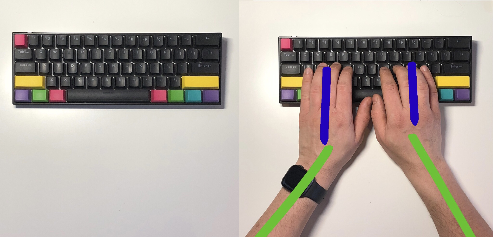
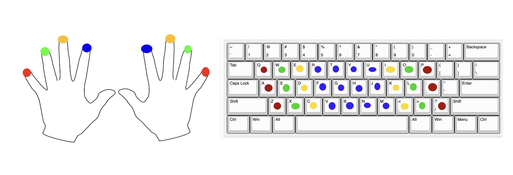
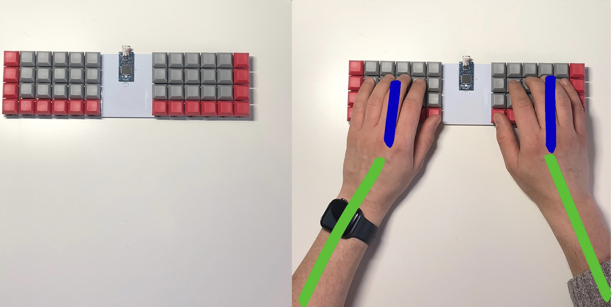
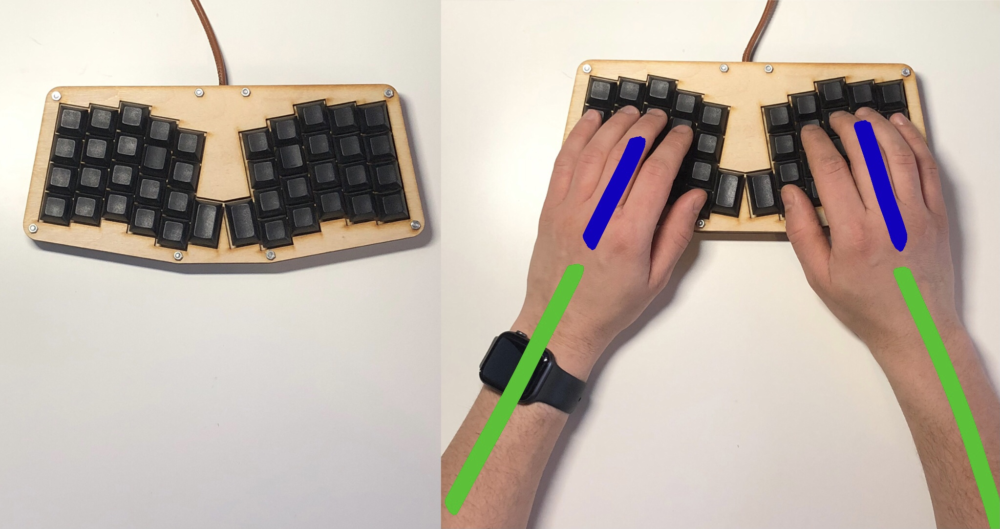
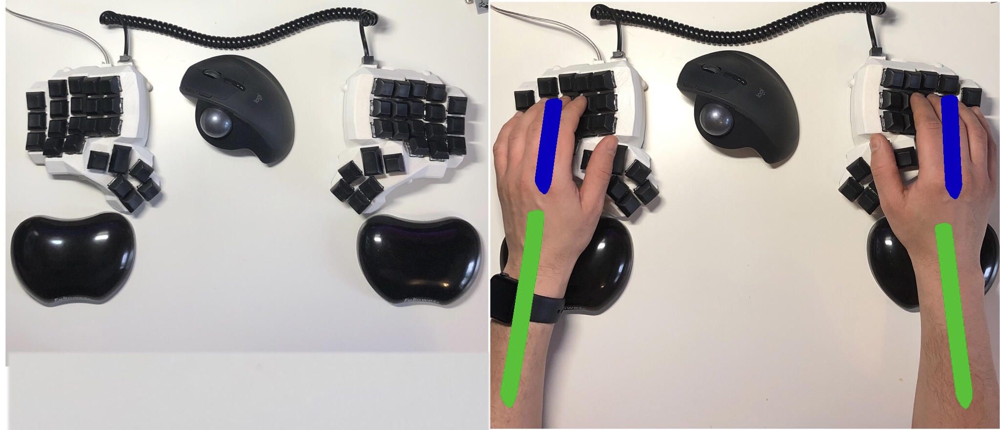

# 8 - Dzielona, czy niedzielona — Oto jest pytanie.
Niniejszy wpis jest rozwinięciem systematycznie zamieszczanego na blogu cyklu dotyczącego poszczególnych cech klawiatur ergonomicznych. Tematem tego wpisu są **klawiatury dzielone** (ang. Split keyboards). Odpowiemy na pytanie, czym są **klawiatury dzielone**, jakie są ich typy. Przeanalizujemy zalety płynące z ich używania, jak i wady tegoż rozwiązania.

Na wstępie muszę jednak nieco uporządkować kolejność postów. Poprzedni wpis dotyczył [Klawiatur z przesunięciem kolumnowym](../7_przesuniecie_kolumnowe/index.md), o, tyle iż klawiatury z _przesunięciem kolumnowym_ najczęściej są **dzielone**, o tyle same **klawiatury dzielone** nie zależą od żadnej innej cechy, występując tym samym w przeróżnych konfiguracjach i z różnymi pozostałymi zestawami cech. Z góry przepraszam za tą nieścisłość w kolejności postów.

# Klawiatura dzielona
Jak można w najprostszy sposób wyobrazić sobie **klawiaturę dzieloną**? Wyobraź sobie, że bierzesz nóż i przecinasz klawiaturę, pionowo, w połowie, tak właśnie od strony technicznej wygląda **klawiatura dzielona**.  
Zatem możemy zastosować następującą definicję:

**Klawiaturą dzieloną** nazywamy taką klawiaturę, w której możemy wyróżnić dedykowane połówki dla każdej z dłoni. Naciśnięcie natomiast jedną ręką klawisza dedykowanego dla drugiej ręki nie jest wykonalne bez odrywania ręki z blatu.

## Bolączki standardowej klawiatury 
Rozważmy standardową klawiaturę _ANSI_, o układzie **QWERTY**, która jest najpopularniejszą opcją dostępną na rynku, jak i w którą wyposażonych jest wiele laptopów. Gdzie dłonie ułożone są obok siebie. Patrząc przez pryzmat pojawiają się dwa problemy:

- Ułożenie naszych dłoni i nadgarstków nie jest w żaden sposób poprawne i zdrowe.
- Brak fizycznego podziału klawiatury z zestawami przycisków dla danej dłoni skutkuje tym iż używamy drugiej ręki do naciskania przycisków przynależących do tej pierwszej. 

### Ergonomia ułożenia

Chciałbym, abyś przyjrzał się powyższej grafice. Lewa połowa przedstawia standardową klawiaturę, na której w prawej części grafiki ułożone zostały dłonie. Zielonymi liniami, dla lepszego kontrastu oznaczyłem ułożenie przedramion, niebieską dłoni. 

Patrząc na powyższy obrazek nasze przedramiona i dłonie układają się w pozycję _leja_. Przedramiona są skierowane do wewnątrz, a dłonie wygięte, aby palce spoczywały poprawnie na **Home Row**. Pozycja ta nie jest ani trochę ergonomiczna. Działa niekorzystnie na nasze barki, jak i nadgarstki, które są wygięte podczas pisania. 

### Pierwsza ręka pomaga drugiej
Drugim problemem, który muszę przyznać nie dotyczy osób piszących poprawnie wszystkimi 10 palcami, to używanie jednej ręki przy wciskaniu klawiszy z połówki dedykowanej drugiej dłoni.

W celu zobrazowania problemu użyję znanej nam dobrze, z poprzednich postów, grafiki. Celowo oznaczyłem korespondujące palce dłoni tym samym kolorowym. Zwróć proszę uwagę, iż klawisze oznaczone, kolorem niebieskim, a zatem te przypisane palcom wskazującym znajdują się blisko siebie. Istnieje ogromne prawdopodobieństwo, iż osoby niepiszące poprawnie 10 palcami będą wykorzystywać palce zamiennie dla tych przycisków. 

Posłużę się własnym przykładem. Osobiście mam problem z literkami **T** i **B**. Niby według podziału, litery te, przypisane są do lewej dłoni, jednak nagminnie używam prawej do ich wciskania. Najczęściej gdy, poprzedzająca lub następująca litera znajduje się w skrajnej lewej części klawiatury, lub gdy wciskam przycisk _Shift_. 

## Klawiatury dzielone — typy
Poniżej przedstawiam znane mi typy klawiatur dzielonych wraz z odpowiadającym obrazkiem ułożenia dłoni. 

### Jednoelementowa, z rozsuniętymi klawiszami.

Pierwszym typem jest klawiatura, w której po prostu robimy przerwę pomiędzy dwiema połówkami. Na rysunku przedstawiam _klawiaturę ortolinearną_, jednak może to być równie dobrze standardowy układ z _przesunięciem wierszowym_, wtedy w przypadku wewnętrznych kolumn utworzą nam się charakterystyczne schodki. 

- Ergonomia ułożenia
	Porównując ułożenie przedramion oraz dłoni widać od razu, iż charakterystyczny lej jest szerszy. Znaczy to tyle, iż przedramiona nie są ułożone pod tak ostrym kątem względem biurka, a kąt między dłoniami i przedramionami jest mniejszy.

- Brak przypisania dłoni do danej połowy
	Ten problem nie występuje, nawet mała przerwa oddzielająca dwie połowy **dzielonej klawiatury** wystarcza, aby wyzbyć się pokusy używania jednej dłoni w celu wciśnięcia przycisków dedykowanych drugiej. 

### Jednoelementowa, z rozsuniętymi klawiszami ułożonymi pod kątem.

Drugim typem jest klawiatura, której połowy nie dość, iż są rozsunięte, to jeszcze ułożone pod kątem. 
- Ergonomia ułożenia
	Dzięki zastosowaniu ułożenia klawiszy pod kątem nasze dłonie i przedramiona są ułożone w lini prostej, co jest zdecydowanie wygodniejsze i korzystne dla naszego zdrowia podczas długich sesji. Nadal nasze przedramiona skierowane są pod pewnym kątem do wewnątrz. Zastanówmy się, czy da się to wyeliminować. 

- Brak przypisania dłoni do danej połowy
	Analogicznie jak poprzednio nie występuje. 

### Dwuelementowa klawiatura dzielona. 

Ostatnim prezentowanym przeze mnie dziś typem klawiatury dzielonej jest dwuelementowa klawiatura, tak zwana prawdziwie dzielona (ang. True split keyboard). W klawiaturze takiej występują fizycznie dwie połówki, które połączone są przewodem lub komunikują się ze sobą poprzez Bluetooth. 

- Ergonomia ułożenia
	Bez dwóch zdań, ułożenie dłoni, przedramion jest najbardziej pożądane. Przedramiona i dłonie są ułożone w jednej lini na szerokości barków. Dodatkowo każda osoba może dostosować szerokość rozsunięcia połówek na szerokość swoich barków, co pozwala zachować porządaną sylwetkę niezależnie od budowy ciała. 

- Brak przypisania dłoni do danej połowy
	Każda połowa obsługiwana jest przez jedną dłoń. 

## Klawiatury dzielone — minusy
Używałem, jako narzędzie codziennej pracy, wszystkich przedstawionych w tym poście klawiatur i jedyna wada, jaką znalazłem podczas mojej kilkuletniej przygody z tymi urządzeniami to **utrudnione pisanie jedną ręką**.

Otóż gdy, dla przykładu oglądamy filmy na platformach streamingowych — w moim wypadku są to kursy online :) - popijając kawę, to jedną ręką musimy obsłużyć klawiaturę co stanowi pewno utrudnienie.

Prawdziwym utrudnieniem, szczególnie w przypadku zastosowania **prawdziwie dzielonej klawiatury — ostatnia** w zestawieniu — jest edycja wideo/audio. Podczas edycji wideo, zwykle, moja jedna dłoń znajduje się na trackballu, druga natomiast obsługiwać powinna klawiaturę gdzie każdy klawisz odpowiada za różne akcje wykonywane na _timeline_. 
Naturalnie, spotkać można osoby, tak biegłe w tych programach, iż do edycji wideo używają jedynie klawiatury. W tym wypadku problem przestaje istnieć. Jednak, jeżeli tak jak ja jesteś amatorem montażu wideo i używasz myszki do poruszania się po _timeline_ dzielona klawiatura podnosi nieco poziom trudności.

---

Pozdrawiam,

amidev

 

